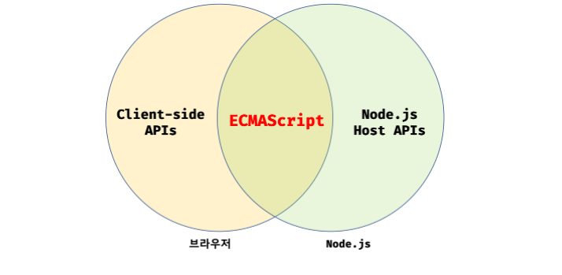

## 01. 프로그래밍

프로그래밍이란 0과 1밖에 알지 못하는 기계가 실행할 수 있을 정도로 정확하고 상세하게 요구사항을 설명하는 작업.

이 때 사람과 컴퓨터 사이 **컴파일러 / 인터프리터**와 같은 일종의 번역기를 사용.
사람은 번역기와 프로그래밍 언어로 소통하고, 컴퓨터는 번역기와 기계어로 소통한다.

## 02. 자바스크립트란?

#### 자바스크립트의 탄생

1995년 넷스케이프에서 경량 프로그래밍 언어를 도입하기로 결정.
브랜던 아이크가 개발한 자바스크립트 도입

#### 자바스크립트의 표준화

마이크로소프트는 파생 버전인 JScript를 인터넷 익스플로러에 도입.
크로스 브라우징 이슈가 발생.
넷스케이프 커뮤니케이션즈는 컴퓨터 시스템의 표준을 관리하는 ECMA 인터내셔널에 자바스크립트 표준화를 요청하고 ECMA-262라 불리는 표준화된 자바스크립트 초판 사양이 완성(ECMAScript).

#### 자바스크립트 성장의 역사

- Ajax
  1999년 JS를 이용해 서버와 브라우저가 비동기 방식으로 데이터를 교환할 수 있는 통신 기능인 Ajax(Asynchronous JavaScript and XML)가 XMLHttpRequest라는 이름으로 등장.
  2005년 구글이 발표한 구글 맵스는 웹 애플리케이션 프로그래밍 언어로서 JS의 가능성을 확인하는 계기가 됨.
- V8 JS Engine
  자바스크립트는 웹 애플리케이션 프로그래밍 언어로서의 가능성이 확인되였고, 더 빠르게 동작하는 자바스크립트 엔진의 필요성이 대두되었다.
  구글의 V8 엔진을 개발하면서 과거 웹 서버에서 수행되던 로직들이 클라이언트로 이동했고 프론트엔드 영역이 주목 받는 계기가 되었다.
- Node.js
  V8 엔진으로 빌드된 JS 런타임 환경.
  브라우저의 JS 엔진에서만 동작하던 JS를 브라우저 이외의 환경에서도 동작하도록 만듬.
- SPA 프레임워크
  복잡해진 개발 과정 -> CBD(Component Based Development) 방법론을 기반으로 하는 SPA(Single Page Application)이 대중화 되면서 Angular, React, Vue.js와 같은 여러 프론트엔드 프레임워크가 등장.

역사를 잘 설명한 게시글: https://velog.io/@teo/frontend

#### 자바스크립트와 ECMAScript

JavaScript > ECMAScript
ECMAScript

- ECMA-262, 스크립팅 언어의 표준 규약, 설명서
- 표준 스크립트 언어(JavaScript는 ECMAScript 사양을 준수하는 범용 스크립팅 언어)

각 브라우저 제조사는 ECMAScript 사양을 준수해서 브라우저에 내장되는 JS 엔진을 구현한다.

자바스크립트는 프로그래밍 언어로서 기본 뼈대를 이루는 ECMAScript와 브라우저가 지원하는 클라이언트 사이드 Web API를 아우르는 개념이다. (Web API는 ECMAScript와 별도로 W3C에서 별도의 사양으로 관리하고 있다.)

#### 자바스크립트의 특징

명령형, 함수형, 프로토타입 기반 객체지향 프로그래밍을 지원하는 멀티 패러다임 프로그래밍 언어다.
