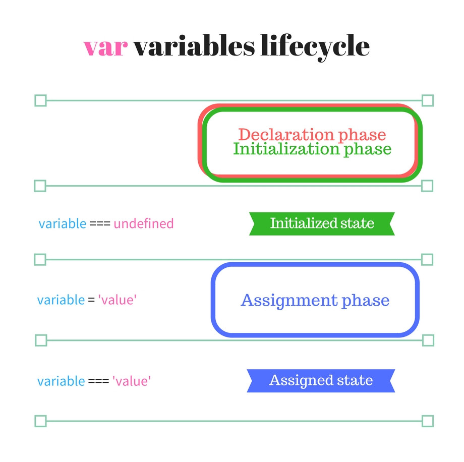
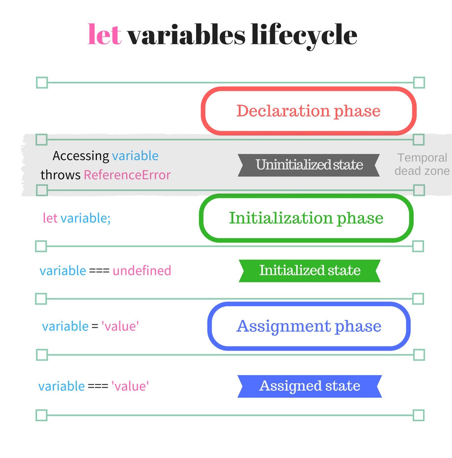
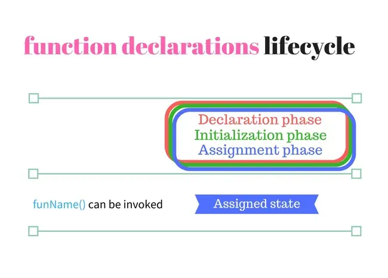

## 호이스팅

프로그래밍 언어 개발자 입장에서 실행하기 전 변수 사전을 만들어 놓는 것이 용이하다.

런타임 이전에 선언 부분을 모두 스캔해서 변수 사전을 미리 만들어 놓는다.
코드가 실행이 되면서 변수들을 부르면 사전에서 꺼내서 주면 된다.

결과적으로 호이스팅은 만들어진 기능이 아닌 JS 엔진에 의해 자연스러운 현상.
const,let의 경우는 호이스팅을 지원하지 않는 것이 아니라 코드를 선언하기 전에는 변수를 사용할 수 없도록 하는 기능을 **추가**한 것이다.

---

변수 lifecycle

1. 선언 단계 (선언 단계는 소스코드 평가 과정에서 실행 컨텍스트에 변수가 등록되는 단계를 의미한다.)
2. 초기화 단계 (메모리가 할당되는 단계)
3. 할당 단계 (값이 할당되는 단계)

소스코드 평가 과정에서 var는 바로 undefined로 초기화되며 선언 단계와 초기화 단계가 같이 일어난다.

하지만 const와 let은 선언 단계와 초기화 단계를 분리한다.
따라서 소스코드 평가 과정에서 실행 컨텍스트에 변수가 등록이 되었지만
메모리가 할당 되지 않아 ReferenceError가 발생한다.
이 때 스코프 시작부터 초기화 단계 이전까지 ReferenceError가 발생하는 구간을 TDZ(일시적 사각지대)라고 한다.

추가적으로 function 키워드는 변수 할당까지 3단계를 동시에 진행한다.
따라서 함수 선언문은 선언되자마자 호출할 수 있다.

---

참고자료

- https://www.youtube.com/watch?v=AlcRl4pJd0c
- https://noogoonaa.tistory.com/78
