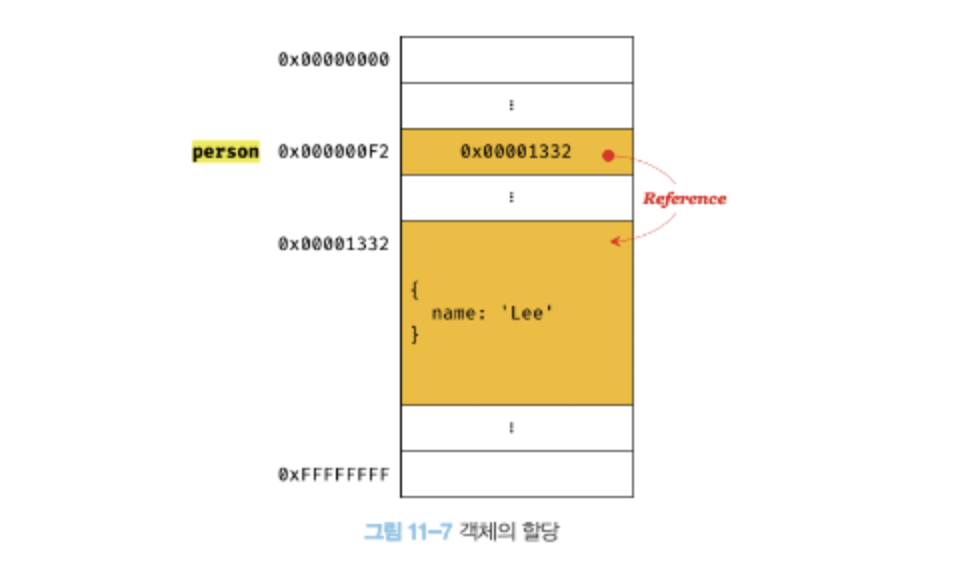

## 11. 원시 값과 객체의 비교

- 원시 값을 변수에 할당하면 변수(확보된 메모리 공간)에는 실제 값이 저장된다.\
  객체를 변수에 할당하면 변수에는 참조 값이 저장된다.
- 값에 의한 전달: 원시 값을 갖는 변수를 다른 변수에 할당하면 원본의 원시 값이 복사되어 저장된다. \
  참조에 이한 전달: 원본의 참조 값이 복사되어 전달된다.

### 원시 값

변경 불가능하다는 것은 변수가 아니라 값에 대한 진술. \
원시 값을 할당한 변수에 새로운 원시 값을 재할당하면 원시 값을 변경하는 것이 아니라 새로운 메모리 공간을 확보하고 재할당한 원시 값을 저장한 후, 변수는 새롭게 재할당한 원시 값을 가리킨다. (재할당은 값의 교체에 의해 일어난다.)

#### 문자열과 불변성

메모리 공간

- 문자 하나: 2바이트
- 숫자: 8바이트

문자열은 유사 배열 객체이면서 이터러블이므로 각 문자에 접근할 수 있다.

_추가) 문자열이 객체인가요?_ \
원시 값을 객체처럼 사용하면 원시 값을 감싸는 래퍼 객체로 자동 변환된다.

문자열에서 각 문자에 인덱스를 통해 접근할 수 있지만 변경할 수 없다. (**읽기 전용 값**)

#### 값에 의한 전달

원시 값을 가진 변수를 다른 변수에 할당했을 때 원시 값이 복사되어 전달된다. \
두 변수는 다른 메모리 공간에 저장되어 있는 같은 값을 갖는다.

_추가) 엄격하게 표현하면 변수에는 값이 전달되는 것이 아니라 메모리 주소가 전달된다. \
변수와 같은 식별자는 값이 아니라 메모리 주소를 기억하고 있다. \
단, 전달된 메모리 주소를 통해 메모리 공간에 접근하면 값을 참조할 수 있다._

### 객체

_JS 객체의 관리 방식_ \
자바스크립트 엔진은 해시 테이블과 유사하지만 높은 성능을 위해 일반적인 해시 테이블보다 나은 방법으로 객체를 구현한다. \
V8 엔진에서는 프로퍼티에 접근하기 위해 동적 탐색 대신 히든 클래스 방식을 사용한다.

#### 변경 가능한 값


변수 person 식별자는 참조 값이 들어있는 메모리 주소를 기억한다. \
해당 메모리 주소는 실제 객체가 들어있는 메모리 주소를 가리킨다.

#### 얕은 복사와 깊은 복사

얕은 복사는 한 단계까지만 복사하는 것을 말하고 깊은 복사는 객체에 중첩되어 있는 객체까지 모두 복사하는 것을 말한다. (복사의 의미: 원본과 참조 값이 다른 객체를 만든다.)

```js
const o = { x: { y: 1 } };

// 얕은 복사
const c1 = { ...o };
console.log(c1 === o); // false
console.log(c1.x === o.x); // true, 참조 값이 같다. 완전히 복사되지 않았다.

// 깊은 복사
const _ = require("lodash");

const c2 = _.cloneDeep(o);
console.log(c1 === o); // false
console.log(c1.x === o.x); // false
```

#### 참조에 의한 전달

객체를 가리키는 변수를 다른 변수에 할당하면 원본의 참조 값이 복사되어 전달된다.

> 결국 "값에 의한 전달"과 "참조에 의한 전달"은 식별자가 기억하는 메모리 공간에 저장되어 있는 값을 복사해서 전달한다는 면에서 동일하다. 다만 식별자가 기억하는 메모리 공간의 값이 원시 값이냐 참조 값이냐의 차이만 있다.
