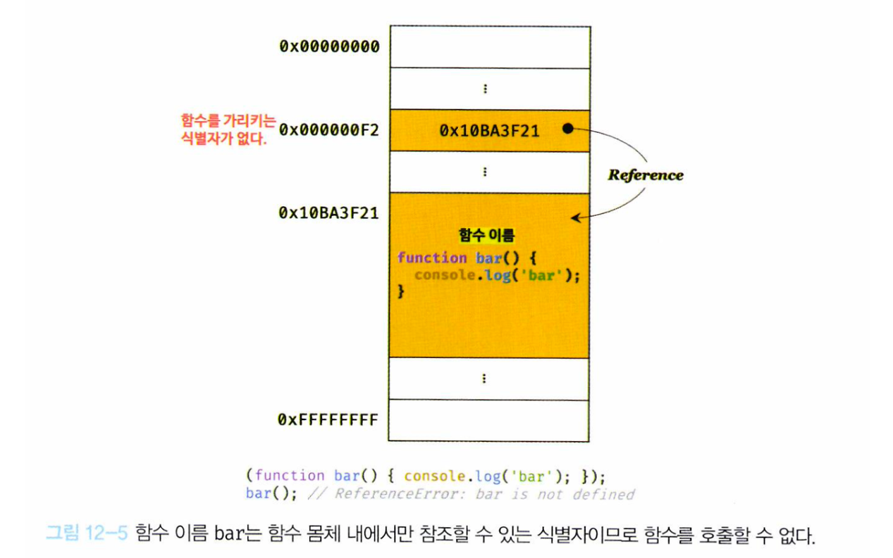
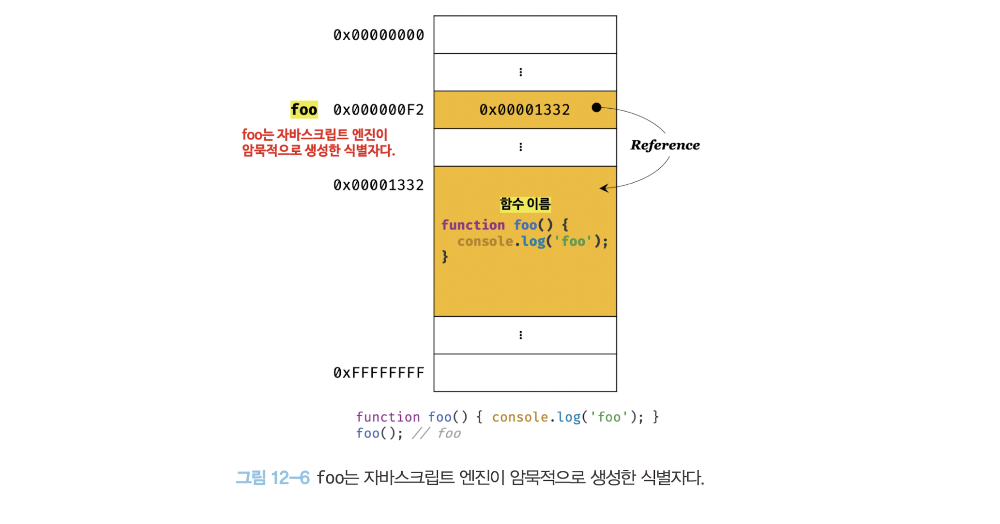

## 12. 함수

함수는 객체 타입의 값이다.
일반 객체는 호출할 수 없지만 함수는 호출할 수 있다.

### 함수 정의

변수는 선언되지만 함수는 **정의**된다.
소스코드 평가 과정에서 함수 선언문이 평가되면 식별자가 암묵적으로 생성되고 함수 객체가 할당된다.


함수를 정의하는 방법에는 4가지가 있다.

1. 함수 선언문
2. 함수 표현식
3. Function 생성자 함수
4. 화살표 함수

#### 함수 선언문과 함수 표현식

함수 선언문은 함수 이름을 생략할 수 없다.
함수 선언문은 표현식이 아닌 문이다. (값으로 평가되지 않는다.)
크롬 개발자 도구의 콘솔에서 확인해보면 완료값 `undefined`가 확인된다.

**함수 선언문과 표현식의 차이**

_예시 1_

```js
const add = function add(x, y) {
  return x + y;
};
```

함수 선언문은 값이 될 수 없기에 변수에 할당할 수 없다.
하지만 위의 예시를 보면 값으로 평가되어 변수에 할당되는 것처럼 보인다.
또 마지막에 세미콜론을 붙이는 것을 확인할 수 있다.
(블록문의 경우 자체가 종결성을 의미하고 있어 세미콜론을 붙이지 않는다.)

이는 JS 엔진이 함수 선언문이 아닌 함수 표현식으로 해석하고 있기 때문이다.
`{}`는 블록문일 수도 있고 객체 리터럴일 수도 있는 중의적 표현이다.
코드 문맥에 따라 해석이 달라진다.
`{}`가 단독으로 존재하면 블록문처럼 해석하고, 값으로 평가되어야 하는 문맥에서 피연산자로 사용되면 객체 리터럴로 해석한다.

_예시 2_

```js
// 함수 선언문
function foo() {
  console.log("foo");
}
foo();

(function bar() {
  console.log("bar");
});
bar(); // ReferenceError
```

그룹 연산자 `()` 내에 있는 함수 리터럴은 함수 표현식으로 해석된다.
그렇다면 bar를 호출할 수 없는 이유에 대해 알아보자.

함수 리터럴에서 함수 이름은 함수 몸체 내에서만 참조할 수 있는 식별자다.
즉 bar의 경우 외부에서 함수를 가리키는 식별자가 없기에 호출할 수 없다.


반면 함수 선언문의 경우 JS 엔진이 암묵적으로 생성한 식별자를 통해 함수를 호출할 수 있다.

함수 선언문을 통한 함수 정의 과정

1. 함수 이름과 동일한 이름의 식별자를 암묵적으로 생성한다. (선언 단계)
2. 함수 객체를 할당한다. (초기화, 할당 단계)



#### 함수 생성 시점과 함수 호이스팅

함수 선언문은 "표현식이 아닌 문"이고 함수 표현식은 "표현식인 문"임을 확인했다.
따라서 함수 호이스팅을 이해할 수 있다.

함수 선언문으로 함수를 정의하면 소스코드 평가 과정에서 함수 이름과 동일한 이름의 식별자를 암묵적으로 생성하고 생성된 함수 객체를 할당한다.

함수 표현식으로 함수를 정의하면 변수에 객체 값을 할당하는 과정이기 때문에 함수가 할당되기 이전 호출할 수 없다.

#### Function 생성자 함수

```js
const add = new Function("x", "y", "return x + y");
```

Function 생성자 함수로 함수를 생성하는 방식은 일반적이지 않으며 바람직하지도 않다. (클로저를 생성하지 않는 등)
함수 선언문이나 함수 표현식으로 생성한 함수와 동일하게 동작하지 않는다는 데만 주목하자.

#### 화살표 함수

- this 바인딩 방식이 다르다.
- prototype 프로퍼티가 없다.
- arguments 객체를 생성하지 않는다.

### 함수 호출

#### 매개변수와 인수

매개변수는 함수 몸체 내부에서 변수와 동일하게 취급된다.
일반 변수와 마찬가지로 처음 **undefined**로 초기화되고, 인수가 순서대로 할당된다. (var 선언처럼 동작한다.)

#### 매개변수의 개수

이상적인 매개변수 개수는 0개이며 적을수록 좋다.
매개변수의 개수가 많다는 것은 함수가 여러 가지 일을 한다는 증거이므로 바람직하지 않다.
이상적인 함수는 한 가지 일만 해야 하며 가급적 작게 만들어야 한다.

매개변수가 3개 이상이라면 객체를 인수로 전달하는 방식을 고려하자.
이 때 주의할 점은 함수 외부에서 함수 내부로 전달한 객체를 함수 내부에서 변경하면 함수 외부의 객체가 변경되는 side effect가 발생한다.

<br />

_side effect에 대한 해결 방안_

객체를 불변 객체로 만들어 사용하는 것이다.
객체의 복사본을 새롭게 생성하는 비용은 들지만 깊은 복사를 통해 새로운 객체를 생성하여 외부 상태가 변경되는 부수 효과를 제거한다.

외부 상태를 변경하지 않고 외부 상태에 의존하지도 않는 함수를 순수 함수라 한다. (동일한 입력이면 동일한 출력 반환)
순수 함수를 통해 side effect를 최대한 억제하여 오류를 피하고 프로그램의 안정성을 높이려는 프로그래밍 패러디임을 **함수형 프로그래밍**이라고 한다.

#### 반환문

return 키워드 뒤에 표현식을 명시적으로 지정하지 않거나 생략한다면 undefined를 반환한다.

반환문은 함수 몸체 내부에서만 사용할 수 있으며 전역에서 반환문을 사용하면 SyntaxError가 발생한다.
(Node.js의 경우는 모듈 시스템에 의해 파일별로 독립적인 파일 스코프를 갖는다. 따라서 파일의 가장 바깥 영역에 반환문을 사용해도 에러가 발생하지 않는다.)

### 다양한 함수의 형태

#### 즉시 실행 함수(IIFE)

즉시 실행 함수는 반드시 그룹 연산자 `()`로 감싸야 한다.
그룹 연산자의 피연산자는 값으로 평가되고 함수 리터럴을 감싸는 경우 값으로 평가되어 함수 객체가 된다.

#### 중첩 함수

함수 내부에 정의된 함수를 중첩 함수라 한다.
중첩 함수는 중첩 함수를 선언한 외부 함수 내부에서만 호출할 수 있다.
일반적으로 중첩 함수는 자신을 포함하는 외부 함수를 돕는 헬퍼 함수의 역할을 한다.

중첩 함수는 스코프와 클로저에 깊은 관련이 있다.
이에 대해 나중에 살펴보자.

#### 콜백 함수

콜백 함수: 함수의 매개변수를 통해 다른 함수 내부로 전달되는 함수
고차 함수: 매개 변수를 통해 함수를 전달받거나 반환값으로 함수를 반환하는 함수

고차 함수는 콜백 함수를 자신의 일부분으로 합성한다.

#### 순수 함수

순수 함수는 어떤 외부 상태에도 의존하지 않고 오직 함수 내부로 전달된 인수에게만 의존해 반환값을 만든다. 또 외부 상태를 변경하지 않는다.
즉, 순수 함수는 어떤 외부 상태에도 의존하지 않으며 외부 상태를 변경하지도 않는 함수다.
(영향을 받지도 않고 영향을 주지도 않으면 언제나 동일한 입력을 주면 동일한 출력을 반환한다.)
