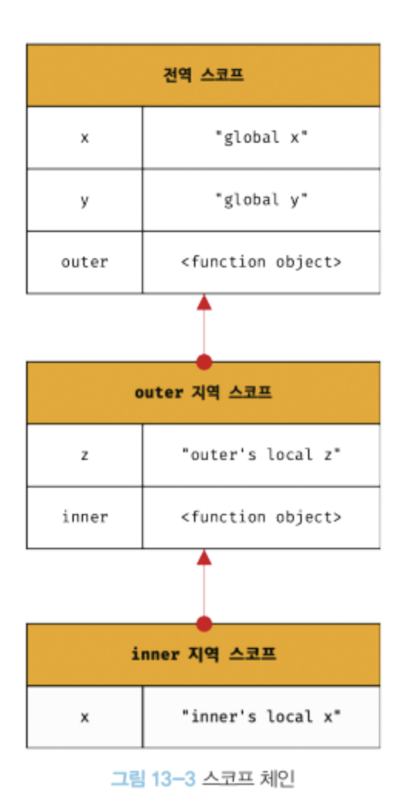

## 13. 스코프

모든 식별자는 **자신이 선언된 위치**에 의해 다른 코드가 식별자 자신을 참조할 수 있는 유효 범위가 결정된다. 이를 스코프라 한다.
즉, 스코프는 **식별자가 유효한 범위**를 말한다.

이름이 동일한 식별자여도 스코프가 다르면 별개의 식별자이다.

### 스코프 체인

스코프는 함수의 중첩에 의해 계층적 구조를 갖는다.



모든 스코프는 하나의 계층적 구조로 연결되며, 모든 지역 스코프의 최상위 스코프는 전역 스코프다. 이렇게 스코프가 계층적으로 연결된 것을 스코프 체인이라 한다.

변수를 참조할 때 JS 엔진은 스코프 체인을 통해 변수를 참조하는 코드의 스코프에서 시작하여 상위 스코프 방향으로 이동하며 선언된 변수를 검색한다.

스코프 체인은 물리적인 실체로 존재한다.
JS 엔진은 런타임 이전에 위 그림과 유사한 자료구조인 **렉시컬 환경**을 실제로 생성한다.
변수 선언 단계에서 이 자료구조에 키로 등록되고, 할당 단계에서 해당하는 값을 변경한다.

_렉시컬 환경_
스코프 체인은 실행 컨텍스트의 렉시컬 환경을 단방향으로 연결한 것.
전역 렉시컬 환경은 코드가 로드되면 곧바로 생성되고 함수의 렉시컬 환경은 함수가 호출되면 곧바로 생성된다.

### 함수 레벨 스코프

**es6 이전**
지역은 함수 몸체 내부를 말하고 지역 스코프를 만든다.
이는 블록문이 아닌 함수에 의해서만 지역 스코프가 생성된다.
JS는 함수 레벨 스코프만 지원한다.

**es6 이후**
let과 const 키워드가 도입되면서 블록 레벨 스코프를 지원한다.

### 렉시컬 스코프

상위 스코프가 결정되는 두 가지 패턴

1. 함수를 어디서 **호출**했는지
2. 함수를 어디서 **정의**했는지

첫 번째 방식을 동적 스코프라 한다. 함수의 상위 스코프는 계속해서 변할 수 있따.
두 번째 방식을 정적 스코프 또는 렉시컬 스코프라한다.
함수 정의가 평가되는 시점에 상위 스코프가 고정된다.

JS는 렉시컬 스코프를 따른다.
즉, 함수의 상위 스코프는 언제나 자신이 정의된 스코프이며 결정된 상위 스코프를 **기억**한다.

_렉시컬 스코프는 클로저와 깊은 관계가 있다._

```js
const x = 1;

function foo() {
  const x = 10;
  bar();
}

function bar() {
  console.log(x);
}

foo(); // 1
bar(); // 1
```
