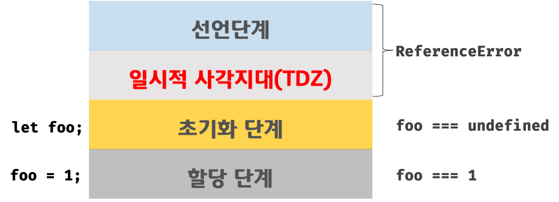

## 15. let, const 키워드와 블록 레벨 스코프

### var 키워드로 선언한 변수의 문제점

1. 변수 중복 선언 허용
   같은 스코프 내에서 중복 선언을 허용한다.
2. 함수 레벨 스코프
   블록문 안에 var로 선언한 변수는 전역 변수가 된다.
3. 변수 호이스팅
   가독성을 떨어뜨리고 오류를 발생시킬 여지를 남긴다.

### let 키워드

1. 변수 중복 선언 금지
   SyntaxError 발생
2. 블록 레벨 스코프
3. 변수 호이스팅
   let 키워드로 선언한 변수는 선언 단계와 초기화 단계가 분리되어 진행된다.
   따라서 스코프의 시작 지점부터 초기화 단계 시작 지점(변수 선언문)까지 변수를 참조할 수 없다. 이 구간을 일시적 사각지대(TDZ)라고 한다.
   

   ```js
   let foo = 1;

   {
     console.log(foo); // ReferenceError
     let foo = 2;
   }
   ```

   ES6에서 도입된 let, const, class는 호이스팅이 발생하지만 발생하지 않는 것처럼 동작한다.

4. 전역 객체와 let
   var 키워드로 선언한 전역 변수와 전역 함수는 전역 객체 window의 프로퍼티가 된다.
   하지만 let 키워드로 선언한 전역 변수는 전역 객체의 프로퍼티가 아니다.
   let 전역 변수는 보이지 않는 개념적인 블록(전역 렉시컬 환경의 선언적 환경 레코드) 내에 존재하게 된다.

### const 키워드

const 키워드로 선언한 변수는 반드시 선언과 동시에 초기화해야 한다.

```js
const foo; // SyntaxError
```
