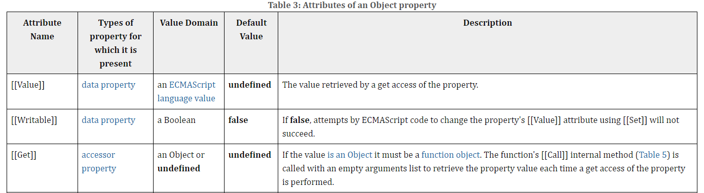
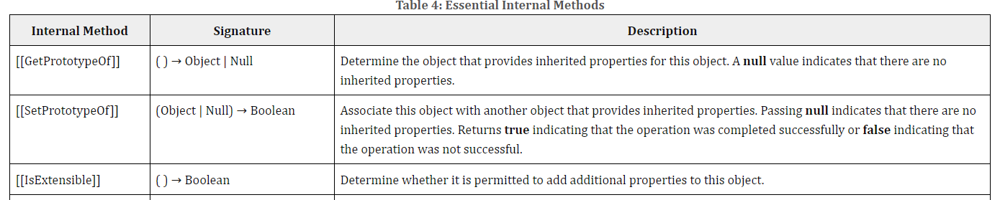

## 16. 프로퍼티 어트리뷰트

### 내부 슬롯과 내부 메서드

내부 슬롯과 내부 메서드는 JS 엔진의 내부 동작 방식을 설명하는 의사코드이다.
객체 내부 상태를 관리하고, 객체의 동작을 정의하는데 사용된다.




ECMA-262에 정의된 의사 코드
의사코드를 지칭하기 위해 `[[...]]`와 같이 표기한다.

내부 슬롯과 내부 메서드에 개발자가 직접적으로 접근하거나 호출할 수 없다.
단, 일부 내부 슬롯과 메서드에 한하여 **간접적**으로 접근할 수 있는 수단을 제공하기는 한다.

_모든 객체는 `[[Prototype]]`이라는 내부 슬롯을 갖는데, 내부 슬롯은 자바스크립트 엔진의 내부 로직이므로 직접 접근할 수 없다. 하지만 `[[Prototype]]` 내부슬롯의 경우, `__proto__`를 통해 접근 가능하다._`

### 프로퍼티 어트리뷰트와 프로퍼티 디스크립터 객체

JS 엔진은 프로퍼티를 생성할 때 프로퍼티의 상태를 나타내는 프로퍼티 어트리뷰트를 기본값으로 자동 정의한다.

프로퍼티 어트리뷰트는 JS 엔진이 관리하는 내부 상태 값인 내부 슬롯 `[[Value]], [[Writable]], [[Enumerable]], [[Configurable]]`이다.

내부 슬롯이기에 직접 접근할 수 없지만 `Object.getOwnPropertyDescriptor` 메서드를 사용하여 간접적으로 확인할 수 있다.

```js
Object.getOwnPropertyDescriptor(person, "name");
// 객체의 한 프로퍼티에 대해 정보를 제공하는 프로퍼티 디스크립터 객체 반환
```

### 데이터 프로퍼티와 접근자 프로퍼티

프로퍼티는 두 가지로 구분할 수 있다.

- 데이터 프로퍼티
- 접근자 프로퍼티 (getter, setter)

#### 데이터 프로퍼티

데이터 프로퍼티는 다음과 같은 프로퍼티 어트리뷰트를 갖는다.

| 프로퍼티 어트리뷰트 | 설명                                                                                                        |
| ------------------- | ----------------------------------------------------------------------------------------------------------- |
| `[[Value]]`         | 프로퍼티 키를 통해 접근하면 반환되는 값                                                                     |
| `[[Writalbe]]`      | 프로퍼티 값의 변경 가능 여부 <br> false인 경우 읽기 전용 프로퍼티가 된다.                                   |
| `[[Enumerable]]`    | 열거 가능 여부 <br> false인 경우 `for...in`문이나 `Object.keys` 메서드 등으로 열거 할 수 없다.              |
| `[[Configurable]]`  | 프로퍼티 재정의 기능 여부 <br> false인 경우 해당 프로퍼티의 삭제, 프로퍼티 어트리뷰트 값의 변경이 금지된다. |

#### 접근자 프로퍼티

자체적으로 값을 갖지 않고 다른 데이터 프로퍼티의 값을 읽거나 저장할 때 사용하는 접근자 함수로 구성된 프로퍼티다.

| 프로퍼티 어트리뷰트 | 설명                                                                                                   |
| ------------------- | ------------------------------------------------------------------------------------------------------ |
| `[[Get]]`           | 접근자 프로퍼티 키로 프로퍼티 값에 접근하면 getter 함수가 호출되고 그 결과가 반환된다.                 |
| `[[Set]]`           | 접근자 프로퍼티 키로 프로퍼티 값을 저장하면 setter 함수가 호출되고 그 결과가 프로퍼티 값으로 저장된다. |
| `[[Enumerable]]`    | -                                                                                                      |
| `[[Configurable]]`  | -                                                                                                      |

### 프로퍼티 정의

`Object.defineProperty` 메서드를 사용하면 프로퍼티의 어트리뷰트를 정의할 수 있다.
인수로는 객체의 참조와 프로퍼티 키인 문자열, 프로퍼티 디스크립터 객체를 전달한다.

### 객체 변경 방지

#### 객체 확장 금지

`Object.preventExtensions`
프로퍼티 추가가 금지된다.

#### 객체 밀봉

`Object.seal`
프로퍼티 추가 및 삭제와 프로퍼티 어트리뷰트 재정의를 금지한다.
읽기와 쓰기만 가능하다.

#### 객체 동결

`Object.freeze`
프로퍼티 값 갱신까지 금지한다.
즉 읽기만 가능하다.

_객체 변경 방지 메서드는 중첩 객체까지 영향을 주지는 못한다. 중첩 객체까지 동결하고 싶다면 객체를 값으로 갖는 모든 프로퍼티에 대해 재귀적으로 Object.freeze 메서드를 호출해야 한다._
