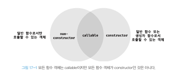

## 17. 생성자 함수에 의한 객체 생성

다양한 객체 생성 방식 중에서 생성자 함수를 사용하여 객체를 생성하는 방식을 알아보자.

### Object 생성자 함수

생성자 함수: new 연산자와 함께 호출하여 인스턴스를 생성하는 함수

new 연산자와 함께 `Object` 생성자 함수(빌트인 생성자 함수)를 호출하면 빈 객체를 생성하여 반환한다.

### 생성자 함수

객체 리터럴에 의한 객체 생성 방식의 문제점 :동일한 프로퍼티를 갖는 객체를 여러 개 생성해야 하는 경우

생성자 함수에 의한 객체 생성 방식은 마치 인스턴스를 생성하기 위한 템플릿(클래스)처럼 생성자 함수를 사용하여 프로퍼티 구조가 동일한 객체 여러 개를 생성할 수 있다.

일반 함수와 동일한 방법으로 생성자 함수를 정의하고, **new 연산자와 함께 호출하면 해당 함수는 생성자 함수로 동작한다.**

<br />

_this_
this가 가리키는 값, 즉 this 바인딩은 함수 **호출 방식**에 따라 **동적**으로 결정된다.
(렉시컬 스코프 개념과 반대다.)
| 함수 호출 방식 | this가 가리키는 값 |
|-----|-----|
| 일반 함수로서 호출 | 전역 객체 |
| 메서드로서 호출 | 메서드를 호출한 객체 |
| 생성자 함수로서 호출 | 생성자 함수가 미래에 생성할 인스턴스 |

```js
function Circle(radius) {
  this.radius = radius;
  this.getDiameter = function () {
    return 2 * this.radius;
  };
}

const circle = Circle(15);
console.log(window.radius); // 15
// 일반 함수로서 호출된 Circle 내의 this는 전역 객체를 가리킨다.
```

#### 생성자 함수의 인스턴스 생성 과정

1. 인스턴스 생성과 this 바인딩
   런타임 이전 소스코드 평가 과정에서 암묵적으로 인스턴스가 생성되고 this에 바인딩된다.
   _바인딩: 식별자와 값을 연결하는 과정
   this(키워드지만 식별자 역할을 함)와 인스턴스 참조 값과 연결한다._
2. 인스턴스 초기화
3. 인스턴스 반환
   생성자 함수 내부의 모든 처리가 끝나면 완성된 인스턴스가 바인딩된 this가 암묵적으로 반환된다.

```js
function Circle(radius) {
  // 1. 암묵적으로 빈 객체가 생성되고 this에 바인딩된다.
  console.log(this); // Circle {}

  // 2. 인스턴스 초기화
  this.radius = radius;
  this.getDiameter = function () {
    return 2 * this.radius;
  };

  // 3. 완성된 인스턴스가 바인딩된 this가 암묵적으로 반환된다.
}
```

생성자 함수 내부에서 명시적으로 this가 아닌 다른 값을 반환하는 것은 생성자 함수의 기본 동작을 훼손한다.
반드시 생성자 함수 내부에서 return 문을 생략하자.

#### 내부 메서드 `[[Call]]`과 `[[Construct]]`

함수는 객체이므로 일반 객체와 동일하게 동작할 수 있다.
함수 객체는 일반 객체가 가지고 있는 내부 슬롯과 내부 메서드를 모두 가지고 있다.

하지만 일반 객체는 호출할 수 없고 함수는 호출할 수 있다.
따라서 함수 객체는 `[[Environment]]`, `[[FormalParameters]]` 등의 내부 슬롯과 `[[Call]]`, `[[Construct]]` 같은 내부 메서드를 추가로 가지고 있다.

함수가 일반 함수로서 호출되면 `[[Call]]`이 호출되고
new 연산자와 함께 호출되면 `[[Construct]]`가 호출된다.

#### constructor와 non-constructor의 구분



함수 정의 방식에 따라 함수를 constructor와 non-constructor로 구분한다.

- constructor: 함수 선언문, 함수 표현식, 클래스(클래스도 함수다.)
- non-constructor: 메서드(축약 표현), 화살표 함수

#### new.target

new.target은 this와 유사하게 constructor인 모든 함수 내부에서 암묵적인 지역 변수와 같이 사용된다.

new 연산자와 함께 호출되는 경우 => new.target은 함수 자신을 가리킨다.
일반 함수로서 호출 되는 경우 => new.target은 undefined이다.

함수 내부에서 new.target을 사용하여 new 연산자와 생성자 함수로서 호출했는지 확인할 수 있고, 그렇지 않은 경우 재귀 호출을 통해 생성자 함수로서 호출할 수 있다.
