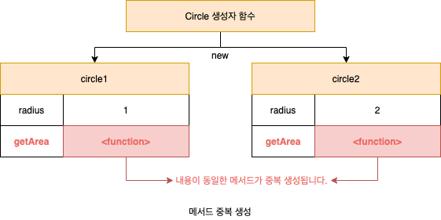
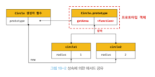
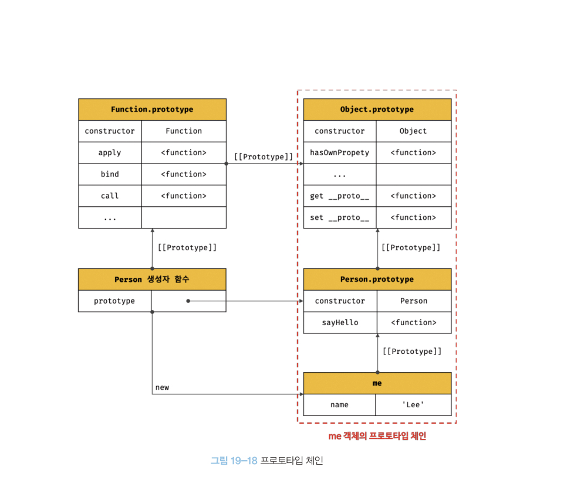
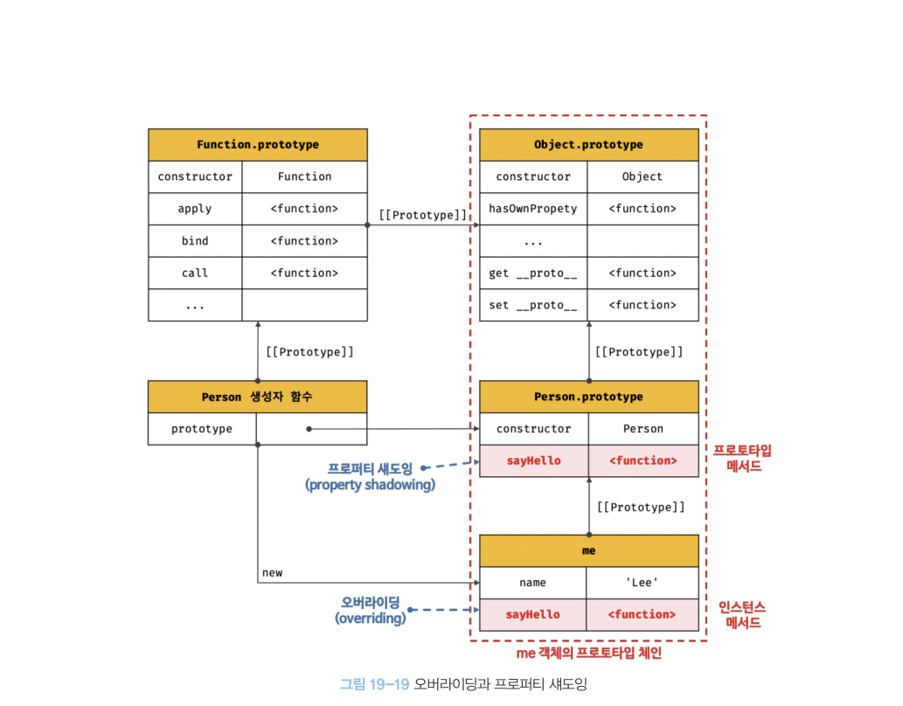
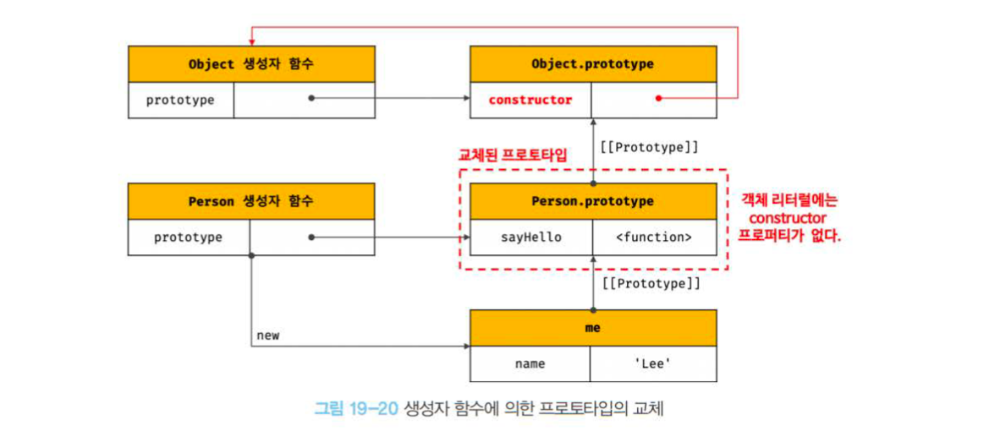
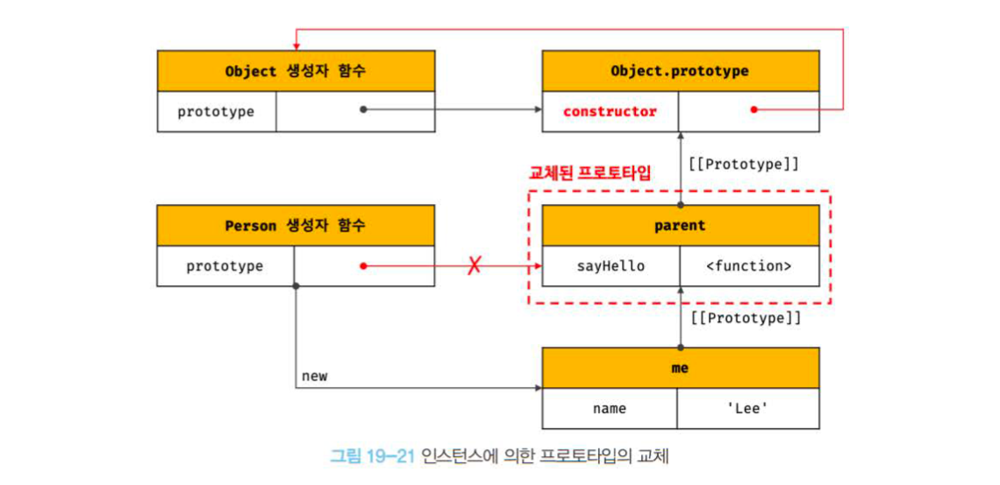

## 19. 프로토타입

### 상속과 프로토타입

상속: 어떤 객체의 프로퍼티 또는 메서드를 다른 객체가 상속 받아 그대로 사용할 수 있는 것을 말하며 객체 지향 프로그래밍의 핵심 개념이다.
JS는 **프로토타입**을 기반으로 상속을 구현하여 불필요한 중복을 제거한다.

 

```js
function Circle(radius) {
  this.radius = radius;
}

// 생성자 함수.prototype: 인스턴스의 프로토타입 객체는 생성자 함수의 prototype에 바인딩되어있다.
Circle.prototype.getArea = function () {
  return Math.PI * this.radius ** 2;
};
```

### 프로토타입 객체

프로토타입은 어떤 객체의 부모 객체 역할을 하는 개체로서 다른 객체에 공유 프로퍼티를 제공한다.

모든 객체는 `[[Prototype]]`이라는 내부 슬롯을 가지며 이 내부 슬롯의 값은 프로토타입의 참조다.
`[[Prototype]]`에 저장되는 프로토타입은 **객체 생성 방식**에 의해 결정된다.
ex) 객체 리터럴 => 프로토타입: Object.prototype
생성자 함수 => 프로토타입: 생성자 함수의 prototype 프로퍼티에 바인딩되어 있는 객체


프로토타입에 접근: `객체.__proto__`, `생성자 함수.prototype`
생성자 함수에 접근: `생성자 함수.prototype.constructor`, `객체.constructor`

#### `__proto__` 접근자 프로퍼티

`__proto__` 접근자 프로퍼티는 상속을 통해 사용된다.
객체가 직접 소유하는 프로퍼티가 아니라 Object.prototype의 프로퍼티다.

`__proto__`는 접근자 프로퍼티다.
`[[Get]]`, `[[Set]]` 프로퍼티 어트리뷰트로 구성된 프로퍼티다.
`Obj.__proto__` => `get __proto__ () {...}` getter 함수 실행
`Obj.__proto__ = parent` => `set __proto__ () {...}` setter 함수 실행

왜 `__proto__` 사용?
상호 참조에 의해 프로토타입 체인이 생성되는 것을 방지하기 위해
프로토타입 체인은 단방향 링크드 리스트로 구현되어야 한다.
따라서 아무런 체크 없이 프로토타입을 교체할 수 없도록 접근자 프로퍼티를 통해 접근하도록 구현되어 있다.

하지만 `__proto__`를 코드 내에서 직접 사용하는 것은 권장 X
모든 객체가 `__proto__`를 사용할 수 있는 것은 아니기 때문에
`Object.getPrototypeOf()`과 `Object.setPrototypeOf()`를 사용하자

```js
Object.getPrototypeOf(obj);
Object.setPrototypeOf(obj, parent);
```

#### 함수 객체의 prototype 프로퍼티

함수 객체만이 소유하는 prototype 프로퍼티는 생성자 함수가 생성할 인스턴스의 프로토타입을 가리킨다.
non-constructor 함수는 prototype 프로퍼티를 소유하지 않으며 프로토타입도 생성하지 않는다.

#### 프로토타입의 constructor 프로퍼티

모든 프로토타입은 constructor 프로퍼티를 갖고, prototype 프로퍼티로 자신을 참조하고 있는 생성자 함수를 가리킨다.
이 연결은 생성자 함수가 생성될 때, 즉 함수 객체가 생성될 때 이뤄진다.

### 리터럴 표기법에 의해 생성된 객체의 생성자 함수와 프로토타입

|                    | 생성자 함수 | 프로토타입         |
| ------------------ | ----------- | ------------------ |
| 객체 리터럴        | Object      | Object.prototype   |
| 함수 리터럴        | Function    | Function.prototype |
| 배열 리터럴        | Array       | Array.prototype    |
| 정규 표현식 리터럴 | RegExp      | RegExp.prototype   |

### 프로토타입의 생성 시점

모든 객체는 생성자 함수와 연결되어 있고, 프로토타입과 생성자 함수는 언제나 쌍으로 존재한다.

프로토타입은 생성자 함수가 생성되는 시점에 더불어 생성된다.
함수는 런타임 이전 선언 단계에서 생성되므로, 인스턴스가 생성되기 이전에 생성자 함수와 프로토타입은 이미 객체화되어 존재한다.
이후 생성자 함수 또는 리터럴 표기법으로 객체를 생성하면 프로토타입은 생성된 객체의 `[[Prototype]]` 내부 슬롯에 할당된다.

### 객체 생성 방식과 프로토타입의 결정

다양한 객체 생성 방식이 있지만 추상연산 `OrdinaryObjectCreate`에 의해 생성된다는 공통점이 있다.

```js
OrdinaryObjectCreate(객체에 추가할 프로퍼티 목록, 생성할 객체의 프로토타입)
```

### 프로토타입 체인

프로토타입의 프로토타입은 언제나 Object.prototype이다.



JS는 객체의 프로퍼티에 접근하려할 때 해당 객체에 프로퍼티가 없다면
`[[Prototype]]` 내부 슬롯의 참조를 따라 부모 역할을 하는 프로토타입의 프로퍼티를 순차적으로 검색한다. 이를 프로토타입 체인이라 한다.
프로토타입 체인은 JS가 객체지향 프로그래밍의 상속을 구현하는 메커니즘이다.

Object.prototype은 프로토타입 체인의 종점이고,
Object.prototype의 `[[Prototype]]` 내부 슬롯 값은 null이다.

식별자 검색은 **스코프 체인**에서 했다면 프로퍼티 검색은 프로토타입 체인에서 일어난다. 따라서 프로토타입 체인은 상속과 프로퍼티 검색을 위한 메커니즘이라 할 수 있다.

### 오버라이딩과 프로퍼티 섀도잉



오버라이딩: 상위 클래스가 가지고 있는 메서드를 하위 클래스가 재정의하여 사용하는 방식

프로퍼티 섀도잉: 프로퍼티 체인에 의해 프로토타입의 프로퍼티가 가려지는 현상

> 하위 객체를 통해 프로토타입에 get 액세스는 허용되나 set 액세스는 허용되지 않는다.

_오버로딩: 함수의 이름은 동일하지만 매개변수의 타입 또는 개수가 다른 메서드를 구현하고, 매개변수에 의해 메서드를 구별하여 호출하는 방식. JS는 오버로딩을 지원하지 않는다._

### 프로토타입의 교체

#### 생성자 함수에 의한 교체

```js
const Person = (function () {
  function Person(name) {
    this.name = name;
  }

  Person.prototype = {
    sayHello() {
      console.log("hi");
    },
  };

  return Person;
})();
```



constructor 프로퍼티와 생성자 함수 간의 연결이 파괴된다.
연결을 되살리기 위해서 constructor 프로퍼티를 추가해야 한다.

#### 인스턴스에 의한 교체

생성자 함수에 의한 교체는 후에 생길 인스턴스의 프로토타입을 교체했다면
인스턴스에 의한 교체는 이미 생성된 객체에 대해 프로토타입을 교체한다.



마찬가지로 constructor 프로퍼티가 존재하지 않는다.
또한 생성자 함수의 프로퍼티가 교체된 프로토타입을 가리키지 않는다.

이처럼 프로토타입의 직접 교체는 꽤나 번거롭다.
상속 관계를 인위적으로 설정하려면 직접 상속이나 클래스를 사용하는 것이 간편하고 직관적이다.

### instancof 연산자

객체가 특정 클래스의 인스턴스인지 확인할 때 사용하는 연산자

`객체 instanceof 생성자 함수`

우변의 생성자 함수의 prototype에 바인딩된 객체가 좌변의 객체의 프로토타입 체인 상에 존재하면 true로 평가되고 그렇지 않으면 false로 평가된다.

### 직접 상속

#### Object.create에 의한 직접 상속

명시적으로 프로토타입을 지정하여 새로운 객체를 생성한다.

`Object.create(프로토타입, { 프로퍼티 키와 프로퍼티 디스크립터 객체로 이뤄진 객체 });`

```js
// 프로토타입 체인의 종점에 위치한다.
// obj -> null
const obj = Object.create(null);
```

프로토타입의 종점에 위치된 객체는 Object.prototype의 빌트인 메서드를 호출할 수 없다.
이 같은 에러가 발생할 위험을 없애기 위해 Object.prototype의 빌트인 메서드는 간접적으로 호출하는 것을 권장한다.

#### 객체 리터럴 내부에서 `__proto__`에 의한 직접 상속

Object.create 메서드에 의한 직접 상속에서 프로퍼티를 정의하는 것은 번거롭다.
객체 리터럴 내부에서 `__proto__` 접근자 프로퍼티를 사용하여 직접 상속을 구현할 수 있다.

```js
const myProto = { x: 10 };

const obj = {
  y: 20,
  __proto__: myProto,
  // obj -> myProto -> Object.prototype -> null
};
```

### 정적 프로퍼티 / 메서드

생성자 함수로 인스턴스를 생성하지 않아도 참조/호출할 수 있는 프로퍼티/메서드를 말한다.

생성자 함수도 객체이므로 자신의 프로퍼티와 메서드를 소유할 수 있다.

정적 프로퍼티/메서드는 생성자 함수로만 참조/호출할 수 있지만 프로토타입 프로퍼티/메서드는 프로토타입 체인 내 하위의 모든 객체가 참조/호출할 수 있다.

### 프로퍼티 존재 확인

#### in 연산자

객체 내 특정 프로퍼티가 존재하는지 여부를 확인한다.

```js
// key: 프로퍼티 키를 나타내는 문자열
key in object;

console.log("name" in person); // true
```

in 연산자는 확인 대상 객체의 프로퍼티뿐만 아니라 상속받은 모든 프로토타입의 프로퍼티를 확인한다.

#### Object.prototype.hasOwnProperty 메서드

```js
person.hasOwnProperty("name");
```

인수로 전달받은 프로퍼티 키가 객체 고유의 프로퍼티 키인 경우에만 true를 반환한다.

### 프로퍼티 열거

#### for...in 문

for...in 문은 객체의 프로토타입 체인 상에 존재하는 모든 프로토타입의 프로퍼티 중에서 프로퍼티 어트리뷰트 `[[Enumerable]]` 값이 true인 프로퍼티를 순회하며 열거한다.

프로퍼티 키가 숫자가 아닌 객체에 대해서는 순서를 보장하지 않는다.

배열에는 for...in 문을 사용하지 않는 것을 권장한다.
배열도 객체이므로 프로퍼티와 상속받은 프로퍼티가 포함될 수 있다.

#### Object.keys/values/entries 메서드

Object.keys: 객체 자신의 열거 가능한 프로퍼티 키를 배열로 반환한다.
Object.values: 객체 자신의 열거 가능한 프로퍼티 값을 배열로 반환한다.
Object.entries: 객체 자신의 열거 가능한 프로퍼티 키와 값의 쌍의 배열을 배열에 담아 반환한다.
