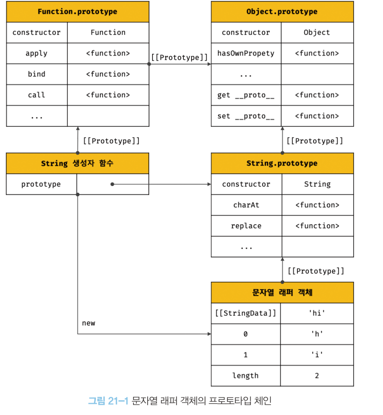

## 20. strict mode

strict mode: JS 언어의 문법을 좀 더 엄격히 적용하여 오류를 발생시킬 가능성이 높거나 JS 엔진의 최적화 작업에 문제를 일으킬 수 있는 코드에 대해 명시적인 에러를 발생시킨다.

`use strict;`

strict mode는 스크립트 단위로 적용된다.
따라서 즉시 실행 함수로 감싼 스크립트 단위로 적용하는 것이 바람직하다.

## 21. 빌트인 객체

JS 객체는 다음과 같이 크게 3개의 객체로 분류할 수 있다.

- 표준 빌트인 객체
  ECMAScript 사양에 정의된 객체를 말하며, 애플리케이션 전역의 공통 기능을 제공한다. JS 환경에 관계없이 언제나 사용할 수 있으며 전역 객체의 프로퍼티로 제공돼 별도의 선언 없이 전역 변수처럼 언제나 참조할 수 있다.

- 호스트 객체
  JS 실행환경에서 추가로 제공하는 객체
- 사용자 정의 객체

### 표준 빌트인 객체

Math, Reflect, JSON(정적 메서드만 제공)을 제외한 표준 빌트인 객체(프로토타입 메서드와 정적 메서드를 제공)는 모두 생성자 함수 객체다.

### 원시값과 래퍼 객체

원시값이 존재하는데도 String, Number, Boolean 등의 표준 빌트인 생성자 함수가 존재하는 이유?

원시값에 대해 객체처럼 마침표 표기법이나 대괄호 표기법으로 접근하면 JS 엔진이 일시적으로 원시값을 연관된 객체로 변환한다.
**즉, 원시값을 객체처럼 사용하면 JS 엔진은 암묵적으로 연관된 객체를 생성하여 생성된 객체로 프로퍼티에 접근하거나 메서드를 호출하고 다시 원시값으로 되돌린다.**
이 때 원시값에 대해 객체처럼 접근하면 생성되는 **임시 객체**를 **래퍼 객체**라 한다.

그 후 래퍼 객체의 처리가 종료되면 래퍼 객체의 내부 슬롯에 할당된 원시값으로 되돌리고 래퍼 객체는 가비지 컬렉션의 대상이 된다.

String, Number, Boolean 생성자 함수를 new 연산자와 함께 호출하여 인스턴스를 생성할 필요가 없으며 권장하지 않는다. 리터럴로 원시값을 생성하고 래퍼 객체를 이용하여 프로토타입 메서드/프로퍼티를 사용하는 것을 권장한다.

null과 undefined는 래퍼 객체를 생성하지 않기 때문에 객체처럼 사용하면 에러가 발생한다.

### 전역 객체

코드가 실행되기 이전 단계에서 어떤 객체보다도 먼저 생성되는 특수한 객체.
브라우저 환경에서는 window, Node.js에서는 global이 전역 객체를 가리킨다.

_globalThis: 브라우저 환경과 Node.js 환경에서 전역 객체를 가리키던 다양한 식별자를 통일한 식별자_

전역 객체는 계층적 구조상 어떤 객체에도 속하지 않은 모든 빌트인 객체의 최상위 객체다.
전역 객체가 최상위 객체라는 것은 프로토타입 상속 관계상에서 최상위 객체라는 의미는 아니다.

#### 빌트인 전역 프로퍼티

Infinity, NaN, undefined

#### 빌트인 전역 함수

eval
JS 코드를 나타내는 문자열을 인수로 전달받는다.
전달받은 문자열 코드가 표현식이라면 런타임에 값을 생성하고
표현식이 아닌 문이라면 문자열 코드를 런타임에 실행한다.
보안과 최적화 문제 때문에 **eval 함수의 사용은 금지**해야 한다.

isFinite
전달받은 인수가 정상적인 유한수인지 검사하는 메서드
인수의 타입이 숫자가 아닌 경우 숫자로 타입을 변환한 후 검사를 수행한다.
이 때 NaN으로 평가되는 값이라면 false를 반환한다.

isNaN
전달받은 인수가 NaN인지 검사하는 메서드
인수의 타입이 숫자가 아닌 경우 숫자로 타입을 변환한 후 검사를 수행한다.

parseFloat/parseInt
전달받은 문자열 인수를 실수/정수로 해석하여 반환한다.
전달받은 인수가 문자열이 아니면 문자열로 변환한 다음 정수로 해석하여 반환한다.
parseInt의 두 번째 인수로 진법을 나타내는 기수를 전달할 수 있다. 이 때 전달된 문자열을 해당 기수의 숫자로 해석하여 반환한다. 반환값은 언제나 10진수다.

_10진수 숫자를 해당 기수의 문자열로 변환하여 반환하고 싶을 때는 `Number.prototype.toString` 메서드를 사용한다._

encodeURI/decodeURI
encodeURI: 완전한 URI를 전달받아 이스케이프 처리를 위해 인코딩한다.
decodeURI: 인코딩된 URI를 인수로 전달받아 이스케이프 처리 이전으로 디코딩한다.
이스케이프 처리: 네트워크를 통해 정보를 공유할 때 어떤 시스템에서도 읽을 수 있는 아스키 문자 셋으로 변환하는 것

 

_URI, URL, URN_
URI: 리소스를 식별하는 문자열. 식별자
URL: 리소스의 위치를 지정, 접근
URN: 리소스의 이름을 지정

참고 자료: https://auth0.com/blog/url-uri-urn-differences/

