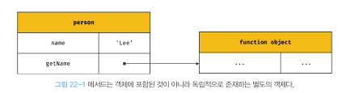

## 22. this

자신이 속한 객체 또는 자신이 생성할 인스턴스를 가리키는 특수한 식별자가 필요하다.

함수를 호출하면 this가 암묵적으로 함수 내부에 전달되며
this가 가리키는 값, 즉 this 바인딩은 **함수 호출 방식**에 의해 **동적**으로 결정된다.

### 함수 호출 방식과 this 바인딩

함수를 호출하는 방식

1. 일반 함수 호출
2. 객체의 메서드 호출
3. 생성자 함수 호출
4. Function.prototype.apply/call/bind 메서드에 의한 간접 호출

#### 일반 함수 호출

일반 함수로 호출하면 함수 내부의 this에는 전역 객체가 바인딩된다.
strict mode가 적용된 일반 함수의 내부의 this에는 undefined가 바인딩된다.

일반 함수로 호출된 모든 함수(중첩 함수, 콜백 함수) 내부의 this에는 전역 객체가 바인딩된다.
이는 콜백 함수, 중첩 함수가 헬퍼 함수로 동작하기 어렵게 만든다.

메서드 내부의 중첩 함수나 콜백 함수의 this 바인딩을 메서드의 this 바인딩과 일치시키기 위한 방법

1. 메서드에서 this를 할당할 변수 선언
   `const that = this;`
2. Function.prototype.bind 메서드

```js
const obj = {
  value: 100,
  foo() {
    setTimeout(
      function () {
        console.log(this.value);
      }.bind(this),
      100
    );
  },
};
```

3. 화살표 함수

```js
// 화살표 함수 내부의 this는 상위 스코프의 this를 가리킨다.
const obj = {
  value: 100,
  foo() {
    setTimeout(() => {
      console.log(this.value);
    }, 100);
  },
};
```

#### 메서드 호출

주의할 것은 메서드 내부의 this는 메서드를 소유한 객체가 아닌 메서드를 **호출**한 객체에 바인딩된다는 것이다.



#### 생성자 함수 호출

생서자 함수 내부의 this에는 생성자 함수가 생성할 인스턴스가 바인딩된다.

#### Function.prototype.apply/call/bind

apply/call: this로 사용할 객체와 인수 리스트를 전달받아 함수를 호출한다.
bind: 함수를 호출하지 않고 this로 사용할 객체만 전달한다.

<br>
<br>

**함수 호출 방식에 따른 this 바인딩 정리**

| 함수 호출 방식                                             | this 바인딩                            |
| ---------------------------------------------------------- | -------------------------------------- |
| 일반 함수 호출                                             | 전역 객체                              |
| 메서드 호출                                                | 메서드를 호출한 객체                   |
| 생성자 함수 호출                                           | 생성자 함수가 미래에 생성할 인스턴스   |
| Function.prototype.apply/call/bind 메서드에 의한 간접 호출 | 각 메서드에 첫 번째 인수로 전달한 객체 |
