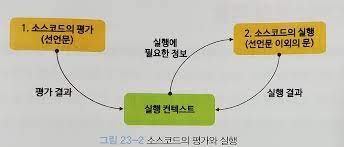
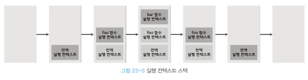
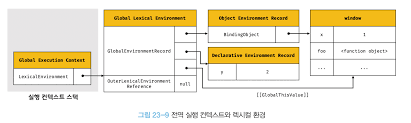
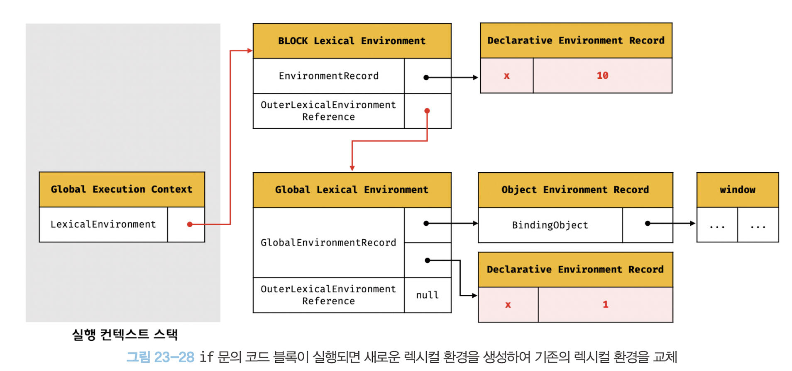

## 23. 실행 컨텍스트

코드를 실행하는데 필요한 환경을 제공하는 객체
코드가 실행되려면 스코프, 식별자 / 코드 실행 순서 등의 관리가 필요하다.
JS에서는 실행 컨텍스트를 통해 이를 관리한다.
좀 더 구체적으로 말해, 실행 컨텍스트는 식별자를 등록하고 관리하는 스코프와 코드 실행 순서 관리를 구현한 내부 메커니즘으로, 모든 코드는 실행 컨텍스트를 통해 실행된다.

식별자, 스코프 => 실행 컨텍스트의 렉시컬 환경으로 관리
코드 실행 순서 => 실행 컨텍스트 스택으로 관리

### 소스코드의 타입

1. 전역 코드: 전역에 존재하는 소스코드. 전역에 정의된 함수, 클래스 등의 **내부 코드**는 포함되지 않는다.
2. 함수 코드: 함수 내부에 중첩된 함수, 클래스 등의 내부 코드는 포함되지 않는다.
3. eval 코드: eval에 인수로 전달되어 실행되는 소스코드
4. 모듈 코드: 모듈 내부에 존재하는 소스코드. 모듈 내부의 함수, 클래스 등의 내부 코드는 포함되지 않는다.

소스코드의 타입에 따라 실행 컨텍스트를 생성하는 과정과 관리 내용이 다르다.

### 소스코드의 평가와 실행

모든 소스코드는 실행에 앞서 평가 과정을 거치며 코드를 실행하기 위한 준비를 한다.
JS 엔진은 소스코드를 2개의 과정, 즉 소스코드의 평가와 소스코드의 실행으로 나누어 처리한다.



### 실행 컨텍스트 스택

**코드 실행 순서**

함수가 **호출**되면 함수 코드를 평가하여 함수 실행 컨텍스트를 생성한다.
그리고 실행 컨텍스트 스택에 push된다.

함수가 종료되면 해당 실행 컨텍스트가 실행 컨텍스트 스택에서 pop된다.

실행 컨텍스트 스택의 최상위에 존재하는 실행 컨텍스트는 언제나 현재 실행 중인 코드의 실행 컨텍스트다.



### 렉시컬 환경

**식별자, 스코프**

- 렉시컬 환경은 식별자와 식별자에 바인딩된 값, 그리고 상위 스코프에 대한 참조를 기록하는 자료구조로 실행 컨텍스트를 구성하는 컴포넌트다.
- 렉시컬 환경은 식별자와 스코프를 관리한다.
- 렉시컬 환경은 스코프를 구분하여 식별자를 등록하고 관리하는 렉시컬 스코프의 실체다.

렉시컬 환경은 두 개의 컴포넌트로 구성된다.

1. 환경 레코드
   스코프에 포함된 식별자를 등록하고 등록된 식별자에 바인딩된 값을 관리하는 저장소
2. 외부 렉시컬 환경에 대한 참조
   상위 스코프를 가리킨다. 이 때 상위 스코프란 해당 실행 컨텍스트를 생성한 소스코드를 포함하는 **상위 코드의 실행 컨텍스트의 렉시컬 환경**을 말한다.
   (렉시컬 환경은 실행 컨텍스트 내에 존재한다.)
   외부 렉시컬 환경에 대한 참조를 통해 단방향 링크드 리스트인 스코프 체인을 구현한다.

### 실행 컨텍스트의 생성과 식별자 검색 과정

#### 전역 코드 평가

```
1. 전역 실행 컨텍스트 생성
2. 전역 렉시컬 환경 생성
   2.1. 전역 환경 레코드 생성
   - 객체 환경 레코드 생성
   - 선언적 환경 레코드 생성(let, const)
   2.2 this 바인딩
   2.3 외부 렉시컬 환경에 대한 참조 결정
```



<br>
<br>

**1. 전역 실행 컨텍스트 생성**
먼저 비어있는 전역 실행 컨텍스트를 생성하여 실행 컨텍스트 스택에 푸시한다.

**2. 전역 렉시컬 환경 생성**
전역 렉시컬 환경을 생성하고 전역 실행 컨텍스트에 바인딩 한다.

**2.1. 전역 환경 레코드 생성**
let과 const 키워드로 선언한 전역 변수를 구별하여 관리하기 위해 전역 환경 레코드는 객체 환경 레코드와 선언적 환경 레코드로 구성되어 있다.

**2.1.1. 객체 환경 레코드 생성**

전역 환경 레코드를 구성하는 컴포넌트인 객체 환경 레코드는 `BindingObject`라고 부르는 객체와 연결되는데 이 때 `BindingObject`는 전역 객체다.

전역 코드 평가 과정에서 var 키워드로 선언한 전역 변수와 함수 선언문으로 정의된 전역 함수는 전역 환경 레코드의 객체 환경 레코드에 연결된 `BindingObject`를 통해 전역 객체의 프로퍼티와 메서드가 된다.
**함수 선언문이 평가되고 객체 환경 레코드에 등록됨 -> `BindingObject`의 프로퍼티와 메서드로 등록**
이것이 var 키워드의 전역 변수와 전역 함수가 전역 객체의 프로퍼티와 메서드가 되고, 전역 객체를 가리키는 식별자 없이 전역 객체의 프로퍼티를 참조할 수 있는 메커니즘

**2.1.2. 선언적 환경 레코드 생성**

let과 const로 선언한 전역 변수는 선언적 환경 레코드에 등록되고 관리된다.

**2.2 this 바인딩**
`[[GlobalThisValue]]` 내부 슬롯에 전역 객체가 바인딩된다.

**2.3 외부 렉시컬 환경에 대한 참조 결정**

현재 평가 중인 소스코드를 포함하는 외부 소스코드의 실행 컨텍스트의 렉시컬 환경, 즉 상위 스코프를 가리킨다.
현재 평가 중인 소스코드는 전역 코드이기 때문에 null이 할당된다.
이는 전역 렉시컬 환경이 스코프 체인의 종점에 존재함을 의미한다.

#### 전역 코드 실행

코드가 실행되며 식별자 결정을 위해 식별자를 검색할 때는 실행 중인 실행 컨텍스트에서 식별자를 검색하기 시작한다.
실행 컨텍스트의 렉시컬 환경의 환경 레코드를 검색한다.

만약 실행 중인 실행 컨텍스트의 렉시컬 환경에서 식별자를 검색할 수 없으면 외부 렉시컬 환경에 대한 참조가 가리키는 렉시컬 환경, 즉 상위 스코프로 이동하여 식별자를 검색한다.
전역 렉시컬 환경에서도 검색할 수 없는 식별자는 ReferenceError를 발생시킨다.

#### 함수 평가

1. 함수 실행 컨텍스트 생성
2. 함수 렉시컬 환경 생성
   2.1. 함수 환경 레코드 생성

   2.2. this 바인딩
   `[[ThisValue]]` 내부 슬롯에 바인딩될 객체는 함수 호출 방식에 따라 결정된다.

   2.3. 외부 렉시컬 환경에 대한 참조 결정
   내부 함수가 평가된 시점에 실행 중인 실행 컨텍스트의 렉시컬 환경의 참조가 할당된다.

<br>

_console.log의 실행_
먼저 console의 식별자를 **스코프 체인**에서 검색한다.
전역 렉시컬 환경의 객체 환경 레코드에서 찾을 수 있다.

log 메서드는 console 객체의 **프로토타입 체인**을 통해 검색한다.

식별자: 스코프 체인 내에서 검색
프로퍼티/메서드: 프로토타입 체인 내에서 검색

### 실행 컨텍스트와 블록 레벨 스코프

let과 const 키워드로 선언한 변수의 경우 블록 레벨 스코프를 따른다.
이를 위해 **선언적 환경 레코드를 갖는 렉시컬 환경**을 새롭게 생성하여 기존의 전역 렉시컬 환경을 교체한다.



블록문이 종료되면 이전의 렉시컬 환경으로 되돌린다.

#### 반복문에서 렉시컬 환경

for 문의 경우 코드 블록이 반복해서 실행될 때마다 새로운 렉시컬 환경을 생성한다.

for 문이 평가되면 새로운 렉시컬 환경(LOOP Lexical Environment)를 생성하고 초기화 변수 식별자와 값을 등록한다.
그리고 새롭게 생성된 렉시컬 환경을 현재 실행 중인 실행 컨텍스트의 렉시컬 환경으로 교체한다.

for 문의 코드 블록이 반복 실행되기 시작하면 새로운 렉시컬 환경(PER-ITERATION Lexical Environment)를 생성하고 증감문 반영 이전의 식별자와 값을 등록한다,

for 문의 반복 실행이 종료되면 for 문이 실행되기 이전의 렉시컬 환경을 실행 중인 실행 컨텍스트의 렉시컬 환경으로 되돌린다.
