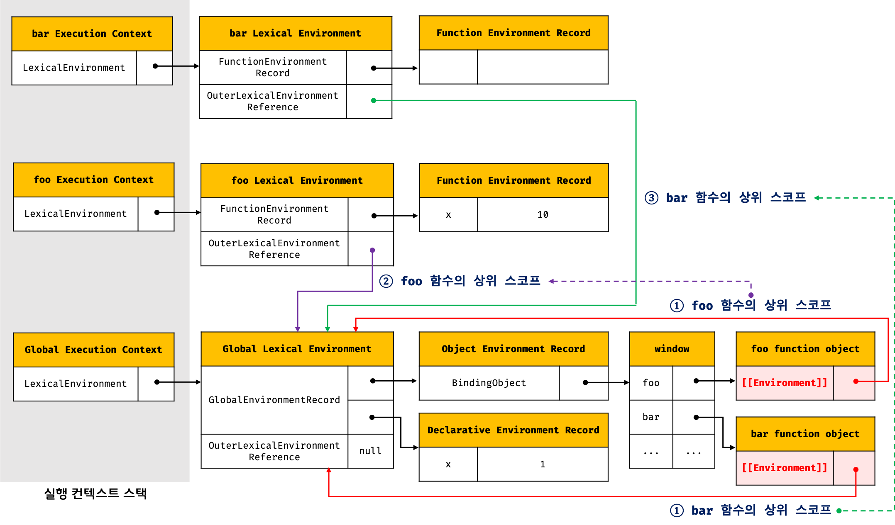
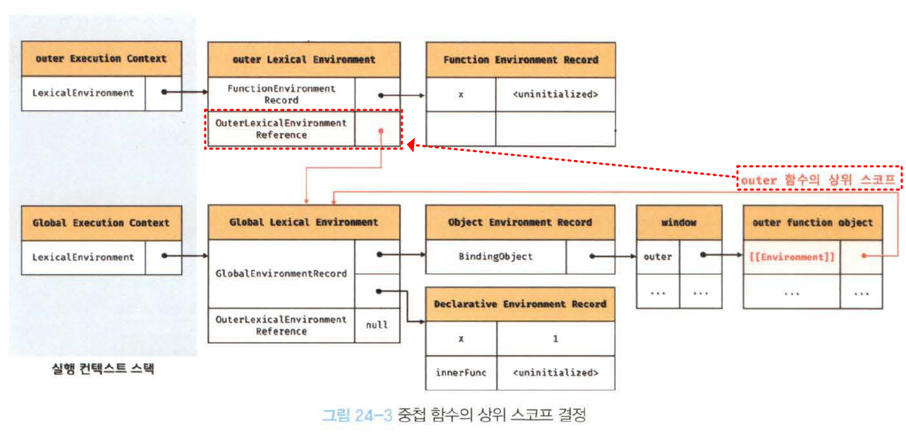
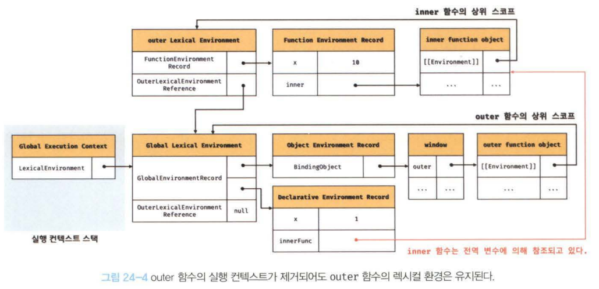
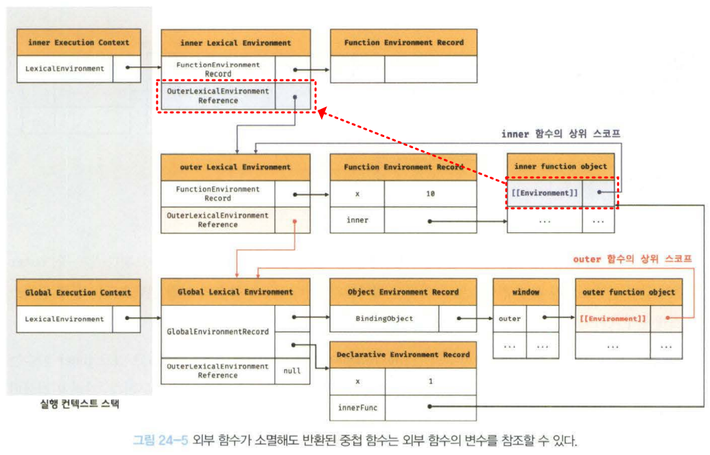

## 24. 클로저

> 클로저는 함수와 그 함수가 선언된 렉시컬 환경(상위 스코프)과의 조합이다.

### 렉시컬 스코프

JS 엔진은 함수를 어디서 호출했는지가 아니라 함수를 어디에 정의했는지에 따라 상위 스코프를 결정한다. 이를 렉시컬 스코프라 한다.

**스코프 === 실행 컨텍스트의 렉시컬 환경**
스코프 체인: 렉시컬 환경은 외부 렉시컬 환경에 대한 참조를 통해 상위 렉시컬 환경과 연결된다.

렉시컬 환경의 "외부 렉시컬 환경에 대한 참조"에 저장할 참조값, 즉 상위 스코프에 대한 참조는 함수가 정의된 환경에 의해 결정된다. 이것이 바로 렉시컬 스코프다.

### 함수 객체의 내부 슬롯 `[[Environment]]`

함수는 자신의 내부 슬롯 `[[Environment]]`에 자신이 정의된 환경, 즉 상위 스코프의 참조를 저장한다.
현재 **실행 중인 실행 컨텍스트의 렉시컬 환경**을 가리킨다.
함수 객체는 내주 슬롯 `[[Environment]]`에 저장한 렉시컬 환경의 참조를 자신이 존재하는 한 기억한다.



함수 객체가 생성될 때 `[[Environment]]`에 실행 중인 실행 컨텍스트의 렉시컬 환경의 참조가 저장된다.

함수가 호출되면 함수 코드를 평가하고 실행 컨텍스트가 생성이 된다.

```
함수 평가 과정
1. 함수 실행 컨텍스트 생성
2. 함수 렉시컬 환경 생성
   2.1. 함수 환경 레코드 생성
   2.2. this 바인딩
   2.3. 외부 렉시컬 환경에 대한 참조 결정
```

이 때 외부 렉시컬 환경에 대한 참조에는 함수 객체의 내부 슬롯 `[[Environment]]`에 저장된 렉시컬 환경의 참조가 할당된다.
이 것이 렉시컬 스코프, 스코프 체인의 실체다.

순서

1. 함수 객체 생성 시 내부 슬롯 `[[Environment]]`에 실행 중인 실행 컨텍스트의 참조값 저장
2. 함수가 호출되어 평가될 때 함수 실행 컨텍스트의 렉시컬 환경 생성 시 외부 렉시컬 환경에 대한 참조가 함수 객체의 내부 슬롯 `[[Environment]]` 값이 전달된다.

### 클로저와 렉시컬 환경

외부 함수보다 중첩 함수가 더 오래 유지되는 경우 중첩 함수는 이미 생명 주기가 종료한 외부 함수의 변수를 참조할 수 있다. 이러한 **중첩 함수**를 클로저라고 부른다.

```js
const x = 1;

function outer() {
  const x = 10;
  const inner = function () {
    console.log(x);
  };
  return inner;
}

const innerFunc = outer();
innerFunc();
```



outer 함수가 호출되고 종료되면 outer 함수의 실행 컨텍스트가 실행 컨텍스트 스택에서 제거된다.
이 때 outer 함수의 렉시컬 환경이 inner 함수의 내부 슬롯 `[[Environment]]`에 의해 참조되고 있기 때문에 렉시컬 환경까지 소멸하지는 않는다.


그리고 inner 함수를 호출하면 함수 실행 컨텍스트가 생성되고 렉시컬 환경의 외부 렉시컬 환경에 대한 참조에는 `[[Environment]]` 내부 슬롯에 저장되어 있는 참조값이 할당된다.



JS의 모든 함수는 상위 스코프를 기억하므로 모든 함수는 클로저다.
하지만 일반적으로 모든 함수를 클로저라고 하지 않는다.

**클로저가 아닌 중첩 함수**

1. 상위 스코프의 식별자를 참조하지 않는 경우
2. 외부 함수보다 중첩 함수가 일찍 소멸되는 경우

클로저는 중첩 함수가 상위 스코프의 식별자를 참조하고 있고 외부 함수보다 더 오래 유지되는 경우에 한정하는 것이 일반적이다.

자유 변수: 클로저에 의해 참조되는 상위 스코프의 변수
클로저는 자유 변수에 묶여있는 함수라고 할 수 있다.

### 클로저의 활용

클로저는 상태를 안전하게 변경하고 유지하기 위해 사용한다.

```js
const increase = (function () {
  let num = 0;

  return function () {
    return ++num;
  };
})();
```

위 코드가 실행되면 즉시 실행 함수가 호출되고 즉시 실행 함수가 반환한 함수가 increase 변수에 할당된다.
이 함수는 자신이 정의된 위치에 의해 결정된 상위 스코프인 즉시 실행 함수의 렉시컬 환경을 기억하는 클로저다.
