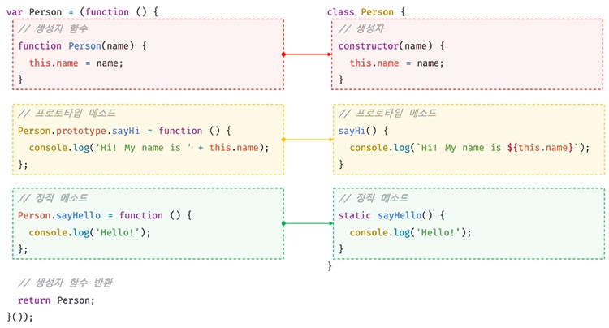
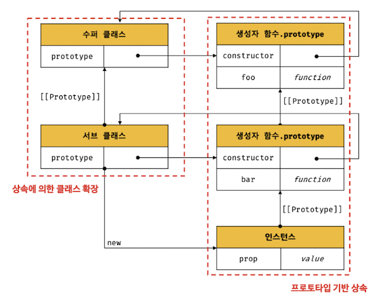

## 25. 클래스

ES6에서 도입된 클래스는 클래스 기반 객체지향 프로그래밍에 익숙한 프로그래머가 더욱 빠르게 학습할 수 있도록 **새로운 객체 생성 메커니즘**을 제시한다.

사실 클래스는 함수이며 **기존 프로토타입 기반 패턴**을 클래스 기반 패턴처럼 사용할 수 있도록 하는 문법적 설탕이다.

**클래스와 생성자 함수의 차이점**

1. 클래스를 new 연산자 없이 호출하면 에러가 발생한다. 생성자 함수에서는 new 연산자 없이 호출하면 일반 함수로서 호출된다.
2. 클래스는 상속을 지원하는 extends와 super 키워드를 제공한다.
3. 클래스는 호이스팅이 발생하지 않는 것처럼 동작한다.
4. 클래스 내의 모든 코드에는 암묵적으로 strict mode가 지정되어 있다.
5. 클래스의 constructor, 프로토타입 메서드, 정적 메서드는 모두 프로퍼티 어트리뷰트 `[[Enumerable]]` 값이 false다. 다시 말해 열거되지 않는다.

### 클래스 정의

```js
// 클래스 선언문
class Person {}
```

클래스는 값으로 사용할 수 있는 일급 객체다.
좀 더 자세히 말하자면 클래스는 함수다.

클래스 몸체에서 정의할 수 있는 메서드는 constructor, **프로토타입 메서드**, 정적 메서드의 세가지가 있다.


클래스와 생성자 함수의 정의 방식은 형태적인 면에서 매우 유사하다.

### 클래스 호이스팅

클래스도 함수이므로 소스코드 평가과정에서 함수 정의가 평가되어 함수 객체가 생성된다. (이 때 생성되는 함수 객체는 constructor이다.)
하지만 let과 const 키워드처럼 선언문 이전에 참조할 수 없다.

### 인스턴스 생성

클래스는 인스턴스를 생성하는 것이 유일한 존재 이유이므로 반드시 new 연산자와 함께 호출해야 한다.

### 메서드

#### constructor

인스턴스를 생성하고 초기화(값을 할당)하기 위한 특수한 메서드

constructor를 생략하면 클래스에는 `constructor() {}`와 같이 빈 constructor가 암묵적으로 정의된다.

### 프로토타입 메서드

클래스 몸체에서 정의한 메서드는 기본적으로 프로토타입 메서드가 된다.

### 정적 메서드

클래스에서는 메서드에 static 키워드를 붙이면 정적 메서드가 된다.

### 클래스의 인스턴스 생성 과정

1. 인스턴스 생성과 this 바인딩
   new 연산자와 함께 클래스를 호출하면 constructor의 내부 코드가 실행되기에 앞서 암묵적으로 빈 객체가 생성된다. 이때 클래스가 생성한 인스턴스의 프로토타입으로 클래스의 prototype 프로퍼티가 가리키는 객체가 설정된다.
   그리고 인스턴스는 this에 바인딩된다.
2. 인스턴스 초기화
3. 인스턴스 반환

### 프로퍼티

#### 인스턴스 프로퍼티

인스턴스의 프로퍼티는 언제나 public하다.

#### 접근자 프로퍼티

접근자 프로퍼티는 자체적으로 값을 갖지 않고 다른 데이터 프로퍼티의 값을 읽거나 저장할 때 사용하는 접근자 함수로 구성된 프로퍼티다.

접근자 프로퍼티는 클래스에서도 사용할 수 있다.
이때 생성된 접근자 프로퍼티는 인스턴스의 프로퍼티가 아닌 프로토타입의 프로퍼티가 된다.

_setter는 단 하나의 값만 할당받기 때문에 단 하나의 매개변수만 선언할 수 있다._

### 클래스 필드 정의

클래스 필드는 **클래스 기반 객체지향 언어**에서 클래스가 생성할 인스턴스의 프로퍼티를 가리키는 용어다.

JS의 클래스 몸체이는 메서드만 선언할 수 있다.
따라서 클래스 몸체에 클래스 필드를 선언하면 SyntaxError가 발생한다.
하지만 모던 브라우저나 최신 Node.js에서 실행하면 정상 동작한다.

JS에서도 인스턴스 프로퍼티를 마치 클래스 기반 객체지향 언어의 클래스 필드처럼 정의할 수 있는 새로운 표준 사양인 Class field declarations가 ECMAScript 사양에 포함되었다.

따라서 클래스 필드를 클래스 몸체에 정의할 수 있다.

```js
class Person {
  name = "Lee";
}

const me = new Person();
console.log(me); // Person {name: "Lee"}
```

클래스 몸체에서 클래스 필드를 정의하는 경우 this에 클래스 필드를 바인딩해서는 안된다.
this는 클래스의 constructor와 메서드 내에서만 유효하다.
(this 바인딩은 생성자 함수가 **호출**될 때 그리고 메서드 내에서 **호출**될 때 일어난다. 클래스에서 생성자 함수 격인 constructor와 메서드 내에서만 유효하다.)

#### private 필드 정의

인스턴스 프로퍼티는 인스턴스를 통해 클래스 외부에서 언제나 참조할 수 있는 public 상태다.

private 필드를 정의할 때는 앞에 #을 붙여준다.
private 필드는 반드시 **클래스 몸체**에 정의해야 한다.

```js
class Person {
  #name = "";

  constructor(name) {
    this.#name = name;
  }
}

const me = new Person("Lee");
console.log(me.#name); // SyntaxError
```

private 필드는 **클래스 내부**에서만 참조할 수 있다.

#### static 필드 정의

클래스에서는 static 키워드를 사용하여 정적 메서드를 정의할 수 있었다.
하지만 정적 필드를 정의할 수는 없었다.

ECMAScript 사양에 클래스 필드 정의 제안이 수용된 이후 static public/private 필드를 사용할 수 있다.

### 상속에 의한 클래스 확장

#### 클래스 상속과 생성자 함수 상속

프로토타입 기반 상속은 프로토타입 체인을 통해 다른 객체의 자산을 상속받는 개념.
상속에 의한 클래스 확장은 기존 클래스를 상속받아 새로운 클래스를 **확장**하여 정의하는 것.


_`[[Prototype]]`의 내부 슬롯 값과 prototype 프로퍼티의 값은 다르다.
클래스도 프로토타입을 통해 상속 관계를 구현한다._

#### 동적 상속

extends 키워드 다음에는 클래스뿐만이 아니라 `[[Construct]]` 내부 메서드를 갖는 함수 객체로 평가될 수 있는 모든 표현식을 사용할 수 있다.

#### 서브클래스의 constructor

서브 클래스에서 constructor를 생략하면 `constructor(...args) { super(...args); }`가 암묵적으로 정의된다.
수퍼 클래스의 constructor를 가져오는 역할을 한다.

#### super 키워드

- super를 호출하면 수퍼클래스의 constructor를 호출한다.
- super를 참조하면 수퍼클래스의 메서드를 호출할 수 있다.

**super 호출**
인스턴스 초기화를 위해 전달한 인수는 수퍼클래스와 서브클래스에 배분되고 두 클래스는 서로 협력하여 인스턴스를 생성한다.

<span style="color:red;">주의 사항</span>

1. 서브클래스에서 constructor를 생략하지 않는 경우 서브클래스의 constructor에서는 반드시 super를 호출해야 한다.
2. 서브클래스의 constructor에서 super를 호출하기 전에는 this를 참조할 수 없다.
   (가장 처음에 호출해라.)
3. super는 반드시 서브클래스의 constructor에서만 호출한다.

**super 참조**
메서드 내에서 super를 참조하면 수퍼클래스의 메서드를 호출할 수 있다.
