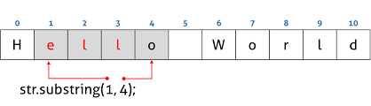

## 32. String

### String 생성자 함수

String 래퍼 객체는 배열과 마찬가지로 length 프로퍼티와 / 숫자와 각 문자를 키와 프로퍼티로 갖는 유사 배열 객체이면서 이터러블이다.

인덱스로 각 문자에 접근은 할 수 있지만, 문자열은 원시값이므로 변경할 수 없다.
이 때 에러가 발생하지 않는다.

new 연산자를 사용하지 않고 String 생성자 함수를 호출하면 문자열을 반환한다.
이를 이용하여 명시적으로 타입을 변환하기도 한다.

### String 메서드

String 객체에는 원본 String 래퍼 객체를 직접 변경하는 메서드는 존재하지 않는다.
String 객체의 메서드는 언제나 새로운 문자열을 반환한다.
문자열은 변경 불가능한 원시값이기 때문에 String 래퍼 객체도 읽기 전용 객체로 제공된다.

#### String.prototype.indexOf

인수로 전달받은 문자열을 검색하여 첫 번째 인덱스를 반환한다.

#### String.prototype.includes

대상 문자열에 인수로 전달받은 문자열이 포함되어 있는지 확인한다.

#### String.prototype.charAt

대상 문자열에서 인수로 전달받은 인덱스에 위치한 문자를 검색하여 반환한다.

#### String.prototype.substring

첫 번째 인수로 전달받은 인덱스에 위치하는 문자부터 두 번째 인수로 전달받은 인덱스에 위치하는 문자의 이전 문자까지의 부분 문자열을 반환한다.



String.prototype.indexOf 메서드와 함께 사용하면 특정 문자열을 기준으로 부분 문자열을 취득할 수 있다.

#### String.prototype.slice

slice 메서드는 substring과 동일하게 동작한다.
단, slice 메서드에는 **음수**인 인수를 전달할 수 있다.
대상 문자열의 가장 뒤에서부터 시작하여 문자열을 잘라내어 반환한다.

#### String.prototype.toUpperCase

#### String.prototype.toLowerCase

#### String.prototype.trim

대상 문자열 **앞뒤**에 공백 문자 있을 경우 이를 제거한 문자열을 반환한다.

#### String.prototype.repeat

대상 문자열을 인수로 전달받은 정수만큼 반복해 연결한 새로운 문자열을 반환한다.

#### String.prototype.replace

첫 번째 인수로 전달받은 문자열 또는 정규표현식을 검색하여 두 번째 인수로 전달한 문자열로 치환한 문자열을 반환

두 번째 인수로 치환 함수를 전달할 수 있다.
첫 번째 인수와 매치된 결과를 치환 함수의 인수로 전달하면서 반환된 결과와 매치 결과를 치환한다.

```js
originalString.replace(/[A-Z]/g, (match) => match.toLowerCase());
```

#### String.prototype.split

문자열을 인수로 전달하여 해당 문자열을 기준으로 전체 문자열을 구분한 후 배열을 반환한다.
