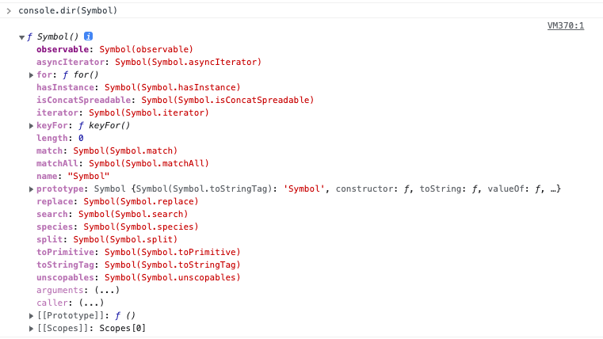

## 33. 7번째 데이터 타입 Symbol

변경 불가능한 원시 타입의 값
다른 **값**과 중복 되지 않는 유일무이한 값
주로 이름의 충돌 위험이 없는 유일한 프로퍼티 키를 만들기 위해 사용한다.

### 심벌 값의 생성

#### Symbol 함수

심벌 값은 Symbol 함수를 호출하여 생성한다.
new 연산자와 함께 호출하지 않는다.
(new 연산자를 호출하면 변경이 가능한 타입의 값인 객체가 생성된다.)

Symbol 함수에는 문자열을 인수로 전달할 수 있다.
이 문자열은 생성된 심벌 값에 대한 **설명**으로 디버깅 용도로만 사용되며 어떠한 영향도 주지 않는다.

```js
const mySymbol1 = Symbol("mySymbol");
const mySymbol2 = Symbol("mySymbol");

console.log(mySymbol1 === mySymbol2); // false
```

심벌 값은 원시 값이지만 객체처럼 접근하면 암묵적으로 래퍼 객체를 생성한다.

심벌 값은 불리언 타입을 제외하고 암묵적으로 타입 변환되지 않는다.

#### Symbol.for / Symbol.keyFor 메서드

Symbol.for 메서드는 인수로 전달받은 문자열을 키로 사용하여 키와 심벌 값의 쌍들이 저장되어 있는 전역 심벌 레지스트리에서 해당 키와 일치하는 심벌 값을 검색한다.
검색에 실패하면 새로운 심벌 값을 생성하고 그 값을 반환한다.
**Symbol 함수를 호출하여 심벌 값을 생성하면 전역 심벌 레지스트리에 등록되어 관리되지 않는다. Symbol.for 메서드를 사용하여 심벌 값을 생성하면 전역 심벌 레지스트리를 통해 공유할 수 있다.**

Symbol.keyFor 메서드는 심벌 값을 인수로 넣어 전역 심벌 레지스트리에 저장된 해당 심벌 값의 키를 추출할 수 있다.

```js
const s2 = Symbol("foo");
Symbol.ekyFor(s2); // undefined
```

### 심벌과 상수

값에는 특별한 의미가 없고 상수 이름 자체에 의미가 있는 경우
상수 값이 변경되거나 중복될 가능성이 있는 경우 심벌 값을 사용할 수 있다.

```js
const Direction = {
  UP: Symbol("up"),
  DOWN: Symbol("down"),
  LEFT: Symbol("left"),
  RIGHT: Symbol("right"),
};

const myDirection = Direction.UP;
```

### 심벌과 프로퍼티 키

프로퍼티 키로 심벌 값을 사용하려면 추적하기 위해 `Symbol.for` 메서드로 심벌 값을 생성한다.
심벌 값을 프로퍼티 키로 사용하려면 심벌 값에 대괄호를 사용해야 한다.
프로퍼티에 접근할 때도 마찬가지로 대괄호를 사용해야 한다.

```js
const obj = {
  [Symbol.for("mySymbol")]: 1,
};

obj[Symbol.for("mySymbol")];
```

심벌 값을 프로퍼티 키로 사용하여 생성한 프로퍼티는 for...in 문이나, Object.keys, Object.getOwnPropertyNames 메서드로 찾을 수 없다.
이처럼 심벌 값을 프로퍼티 키로 사용하면 외부에 노출할 필요가 없는 프로퍼티를 은닉할 수 있다.

### 심벌과 표준 빌트인 객체 확장

일반적으로 표준 빌트인 객체에 사용자 정의 메서드를 직접 추가하여 확장하는 것은 권장하지 않는다.
표준 빌트인 객체는 읽기 전용으로 사용하는 것이 좋다.

```js
Array.prototype.sum = function () {
  return this.reduce((a, c) => a + c, 0);
};

[1, 2].sum();
```

그 이유는 개발자가 직접 추가한 메서드와 미래에 표준 사양으로 추가될 메서드의 이름이 중복될 수 있기 때문이다.
추가된 표준 빌트인 메서드가 사용자 정의 메서드를 덮어 쓸 수 있다.

하지만 중복될 가능성이 없는 심벌 값으로 프로퍼티 키를 생성하여 표준 빌트인 객체를 확장하면 안전하게 표준 빌트인 객체를 확장할 수 있다.

```js
Array.prototype[Symbol.for("sum")] = function () {
  return this.reduce((a, c) => a + c, 0);
};

[1, 2].[Symbol.for("sum")]();
```

### Well-known Symbol

JS가 기본 제공하는 빌트인 심벌 값이 있다.
빌트인 심벌 값은 Symbol 함수의 프로퍼티에 할당되어 있다.



이 심벌 값을 Well-known Symbol이라 부르며 JS 엔진의 내부 알고리즘에 사용된다.

<br>

예를 들어 for...of 문으로 순회 가능한 이터러블은 `Symbol.iterator`를 키로 갖는 메서드를 가지며, Symbol.iterator 메서드를 호출하면 이터레이터를 반환하도록 규정되어 있다.

만약 일반 객체를 이터러블처럼 동작하도록 구현하고 싶다면 `Symbol.iterator`를 키로 갖는 메서드를 객체에 추가하고 이터레이터로 반환하도록 구현하면 된다.

```js
const iterable = {
  [Symbol.iterator]() {
    let cur = 1;
    const max = 5;

    return {
      next() {
        // 클로저 기반으로 구현
        return { value: cur++, done: cur > max + 1 };
      },
    };
  },
};

for (const num of iterable) {
  console.log(num);
}
```

> 이처럼 심벌은 중복되지 않는 상수 값을 생성하는 것은 물론 기존에 작성된 코드에 영향을 주지 않고 새로운 프로퍼티를 추가하기 위해 도입되었다.
