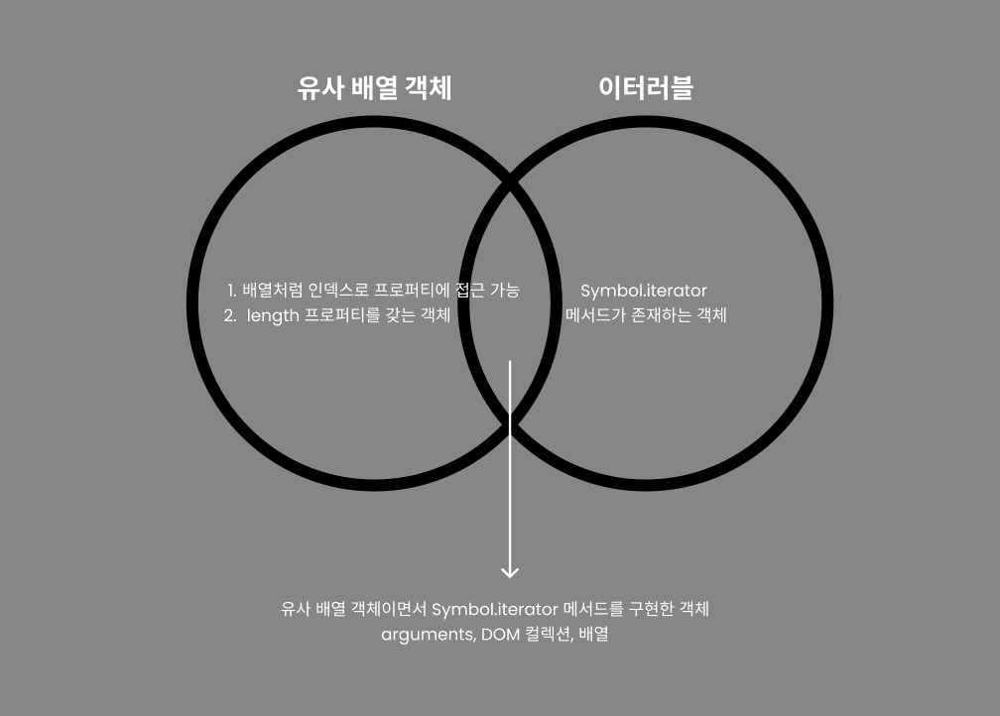

## 34. 이터러블

### 이터레이션 프로토콜

이터레이션 프로토콜: 순회 가능한 자료구조를 만들기 위해 미리 약속한 규칙

ES6 이전의 순회 가능한 데이터 컬렉션, 즉 배열, 문자열, 유사 배열 객체, DOM 컬렉션 등은 **통일된 규약** 없이 각자 나름의 구조를 가지고 for 문, for...in 문, forEach 메서드 등 다양한 방법으로 순회할 수 있었다.

ES6에서는 순회 가능한 데이터 컬렉션을 **이터레이션 프로토콜을 준수하는 이터러블**로 통일하여 for...of 문, 스프레드 문법, 구조 분해 할당의 대상으로 사용할 수 있도록 일원화했다.

이터레이션 프로토콜에는 이터러블 프로토콜과 이터레이터 프로토콜이 있다.

- 이터러블 프로토콜
  `Symbol.iterator`를 프로퍼티 키로 사용한 메서드를 직접 구현하거나,
  프로토타입 체인을 통해 상속 받은 `Symbol.iterator` 메서드를 호출하면 **이터레이터 프로토콜을 준수한 이터레이터**를 반환한다. 이러한 규약을 이터러블 프로토콜이라 하며, **이터러블 프로토콜을 준수한 객체를 이터러블**이라 한다.
  이터러블은 for...of 문으로 순회할 수 있으며, 스프레드 문법과 구조 분해 할당의 대상으로 사용할 수 있다.

- 이터레이터 프로토콜
  `Symbol.iterator` 메서드를 호출하면 이터레이터 프로토콜을 준수한 이터레이터를 반환한다.
  이터레이터는 next 메서드를 소유하며 next 메서드를 호출하면 이터러블을 순회하며 value와 done 프로퍼티를 갖는 이터레이터 리절트 객체를 반환한다.
  이러한 next 메서드를 가진 객체를 이터레이터라 하고, 이터레이터는 이터러블의 요소를 탐색하기 위한 포인터 역할을 한다.


```
Symbol.iterator 메서드 -> 이터레이터 -> 이러레이터 리절트 객체
```

#### 이터러블

**Symbol.iterator 메서드를 가지고 있는 객체**
이터러블 프로토콜을 준수한 객체를 이터러블이라 한다.
즉, 이터러블은 Symbol.iterator를 프로퍼티 키로 사용한 메서드를 직접 구현하거나 프로토타입 체인을 통해 상속받은 객체를 말한다.

예를 들어 배열은 Array.prototype의 Symbol.iterator 메서드를 상속받는 이터러블이다.

#### 이터레이터

**next 메서드를 가지고 있는 객체**
이터러블의 Symbol.iterator 메서드를 호출하면 이터레이터를 반환한다.
이터레이터는 next 메서드를 갖는다.

next 메서드는 이터러블의 각 요소를 순회하기 위한 포인터의 역할을 한다.
next 메서드를 호출하면 이터러블을 순차적으로 한 단계씩 순회하며 순회 결과를 나타내는 이터레이터 리절트 객체를 반환한다.

```js
const array = [1, 2, 3];
const iterator = array[Symbol.iterator]();

console.log(iterator.next()); // { value: 1, done: false }
console.log(iterator.next()); // { value: 2, done: false }
console.log(iterator.next()); // { value: 3, done: false }
console.log(iterator.next()); // { value: undefined, done: true }
// value는 현재 순회중인 값을 나타내고, done은 순회 완료 여부를 나타낸다.
```

### 빌트인 이터러블

다음의 표준 빌트인 객체들은 빌트인 이터러블이다.

Array, String, Map, Set, TypedArray, arguments, DOM 컬렉션
(Object는 없다, 유사 배열 객체는 이터러블이 아니다.)

### for...of 문

for...of 문은 내부적으로 이터레이터의 next 메서드를 호출하여 이터러블을 순회하여 next 메서드가 반환한 이터레이터 리절트 객체의 value 값을 for...of 문의 변수에 할당한다. 이터레이터 리절트 객체의 done 값이 false이면 순회를 계속하고 true이면 순회를 중단한다.

내부 동작을 for 문으로 표현하면 다음과 같다.

```js
const iterable = [1, 2, 3];
const iterator = iterable[Symbol.iterator]();

for (;;) {
    cosnt res = iterator.next()

    if(res.done) break;

    const item = res.value
    console.log(item)
}
```

### 이터러블과 유사 배열 객체

**유사 배열 객체의 조건**

1. 배열처럼 인덱스로 프로퍼티에 접근 가능
2. length 프로퍼티를 갖는 객체



<br>

_`Array.from` 메서드는 유사 배열 객체 또는 이터러블을 인수로 전달받아 배열로 변환하여 반환한다._

### 이터레이션 프로토콜의 필요성

이터러블은 for...of 문, 스프레드 문법, 구조 분해 할당과 같은 데이터 소비자에 의해 사용되므로 데이터 공급자의 역할을 한다고 할 수 있다.

만약 다양한 데이터 공급자가 각자의 순회 방식을 갖는다면 데이터 소비자는 다양한 데이터 공급자의 순회 방식을 모두 지원해야 한다. 하지만 다양한 데이터 공급자가 이터레이션 프로토콜을 준수하도록 규정하면 데이터 소비자는 이터레이션 프로토콜만 지원하도록 구현하면 된다.

**데이터 소비자는 내부에서 Symbol.iterator 메서드를 호출해 이터레이터를 생성하고, 이터레이터의 next 메서드를 호출하여 이터러블을 순회하며 이터레이터 리절트 객체를 반환한다. 그리고 이터레이터의 value/done 프로퍼티 값을 취득한다.**

이처럼 이터레이션 프로토콜은 다양한 데이터 공급자가 하나의 순회 방식을 갖도록 규정하며 데이터 소비자와 데이터 공급자를 연결하는 인터페이스 역할을 한다.


### 사용자 정의 이터러블

일반 객체도 이터레이션 프로토콜을 준수하도록 구현하면 사용자 정의 이터러블이 된다.

```js
const fibonacci = {
  [Symbol.iterator]() {
    let [pre, cur] = [0, 1];
    const max = 10;

    return {
      next() {
        [pre, cur] = [cur, pre + cur];
        return { value: cur, done: cur >= max };
      },
    };
  },
};

for (const num of fibonacci) {
  console.log(num); // 1 2 3 5 8
}
```

만약 max가 없어 이터레이터 리절트 객체의 done 프로퍼티가 항상 false라면 무한 이터러블을 구현할 수 있다.

이때 이터러블은 지연 평가를 통해 데이터를 생성한다.
지연 평가는 데이터가 필요한 시점 이전까지는 미리 데이터를 생성하지 않다가 데이터가 필요한 시점이 되면 그 때 데이터를 생성하는 기법이다.

**데이터 소비자 내부에서 next 메서드가 호출되기 전까지 데이터를 생성하지 않는다.**
이처럼 지연 평가를 사용하면 불필요한 데이터를 미리 생성하는 것을 방지할 수 있다.
