## 38. 브라우저의 렌더링 과정

대부분의 프로그래밍 언어는 운영체제나 가상 머신 위에서 실행되지만 웹 어플리케이션의 클라이언트 사이드 자바스크립트는 브라우저에서 HTML, CSS와 함께 실행된다.

브라우저가 HTML, CSS, 자바스크립트로 작성된 텍스트 문서를 어떻게 파싱(해석)하여 브라우저에 **렌더링**하는지 알아보자.

브라우저는 다음과 같은 과정을 거쳐 렌더링을 수행한다.

1. 브라우저는 HTML, CSS, JS, 이미지, 폰트 파일 등 렌더링에 필요한 리소스를 요청하고 서버로부터 응답을 받는다.
2. 브라우저의 렌더링 엔진은 서버로부터 응답된 HTML과 CSS를 파싱하여 DOM과 CSSOM을 생성하고 이들을 결합하여 렌더 트리를 생성한다.
3. 브라우저의 JS 엔진은 서버로부터 응답된 JS를 파싱하여 AST(Abstract Syntax Tree)를 생성하고 바이트코드로 변환하여 실행한다. JS는 DOM API를 통해 DOM이나 CSSOM을 변경할 수 있다. 변경된 DOM과 CSSOM은 다시 렌더 트리로 결합된다.
4. 렌더 트리를 기반으로 HTML 요소의 레이아웃을 계산하고 브라우저 화면에 HTML 요소를 페인팅한다.

### 요청과 응답

브라우저는 필요한 리소스를 서버에 요청하고 서버로부터 응답받아 브라우저에 시각적으로 렌더링한다. (렌더링에 필요한 리소스는 모두 서버에 존재한다.)

서버에 요청을 전송하기 위해 브라우저는 주소창을 제공한다. 브라우저의 주소창에 URL을 입력하고 엔터 키를 누르면 URL의 호스트 이름이 DNS를 통해 IP 주소로 변환되고 이 IP 주소를 갖는 서버에 요청을 전송한다.

URL을 입력하고 엔터 키를 누르는 하나의 요청만 하더라도 Network 탭을 확인하면 여러 개의 리퀘스트와 리스폰스의 쌍을 확인할 수 있다. 이는 브라우저의 렌더링 엔진이 HTML을 파싱하는 도중에 외부 리소스를 로드하는 태그, 즉 CSS 파일을 로드하는 link 태그, 이미지 파일을 로드하는 img 태그, 자바스크립트를 로드하는 script 태그 등을 만나면 HTML의 파싱을 일시 중단하고 해당 리소스 파일을 서버로 요청하기 때문이다.

### HTTP 1.1과 HTTP 2.0

HTTP(HyperText Transfer Protocol)은 웹에서 브라우저와 서버가 통신하기 위한 규약이다.

HTTP 1.1은 기본적으로 커넥션 당 하나의 요청과 응답만 처리한다.
여러 개의 요청을 한 번에 전송할 수 없고 응답 또한 마찬가지다.

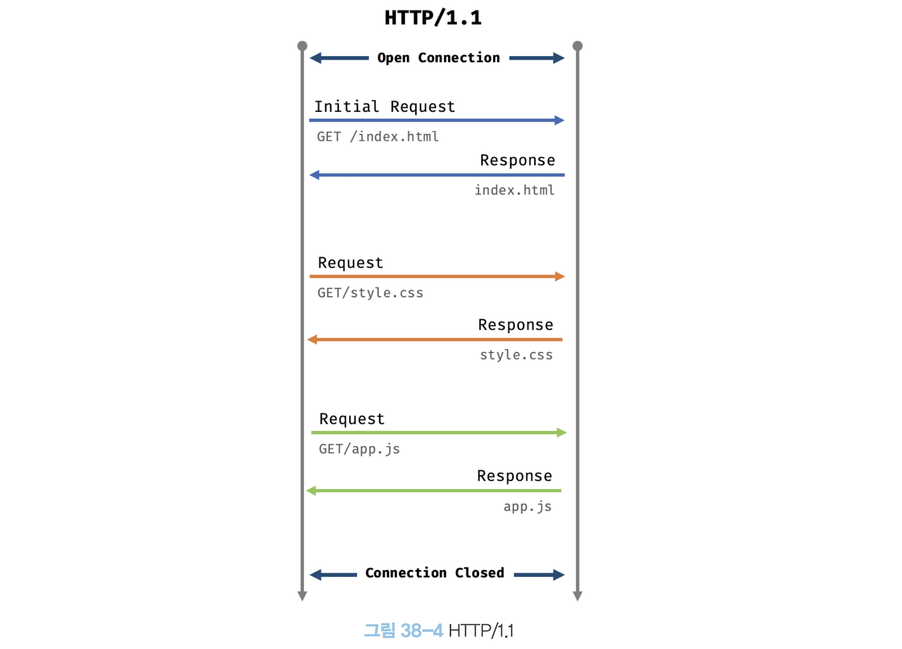

HTTP 2.0은 커넥션 당 여러 개의 요청과 응답, 즉 다중 요청/응답이 가능하다.
HTTP 1.1에 비해 페이지 로드 속도가 약 50% 정도 빠르다고 알려져 있다.

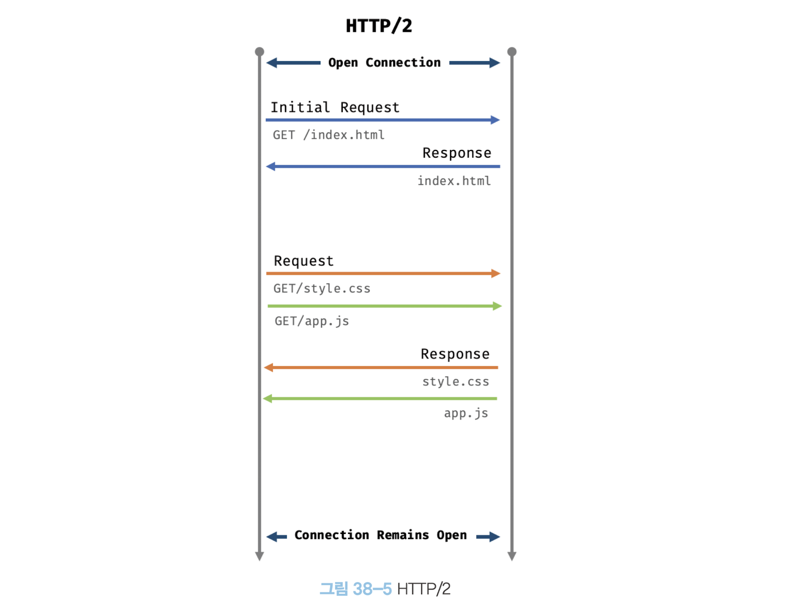

### HTML 파싱과 DOM 생성

HTML 문서는 순수한 텍스트다.
순수한 텍스트인 HTML 문서를 브라우저가 이해할 수 있는 자료구조(객체)로 변환하여 메모리에 저장해야 한다.
이는 **DOM**이다.

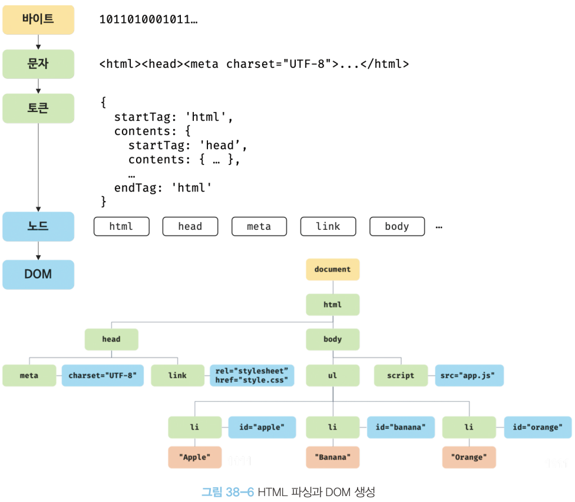

1. 서버에 존재하던 HTML 파일이 브라우저의 요청에 의해 응답된다. 2진수를 인터넷을 경유하여 응답한다.
2. 브라우저는 서버가 응답한 HTML 문서를 2진수 형태로 응답받는다.
   응답된 바이트 형태의 HTML 문서는 meta 태그의 지정된 인코딩 방식을 기준으로 문자열로 변환된다.
3. 문자열로 변환된 HTML 문서를 읽어 코드의 최소 단위인 토큰들로 분해한다.
4. 각 토큰들을 객체로 변환하여 노드들을 생성한다. 토큰의 내용에 따라 문서 노드, 요소 노드, 어트리뷰트 노드, 텍스트 노드가 생성된다.
5. 모든 노드들을 트리 자료구조로 구성한다. 이를 DOM이라 부른다.

**즉 DOM은 HTML 문서를 파싱한 결과물이다.**

### CSS 파싱과 CSSOM 생성

렌더링 엔진은 DOM을 생성해 나가다가 CSS를 로드하는 link 태그나 style 태그를 만나면 DOM 생성을 일시 중단한다.

그 후 CSS을 HTML과 동일한 파싱 과정(바이트 -> 문자 -> 토큰 -> 노드 -> CSSOM)을 거치며 해석하여 CSSOM을 생성한다. 이후 CSS 파싱을 완료하면 HTML 파싱이 중단된 지점부터 다시 HTML을 파싱하기 시작하여 DOM 생성을 재개한다.

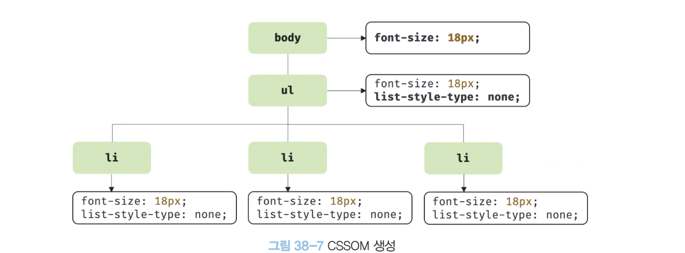

_상속 관계가 반영되어 CSSOM이 생성된다._

### 렌더 트리 생성

렌더링 엔진이 생성한 DOM과 CSSOM은 렌더링을 위해 **렌더 트리**로 결합된다.
브라우저 화면에 렌더링되는 노드만으로 구성된다.

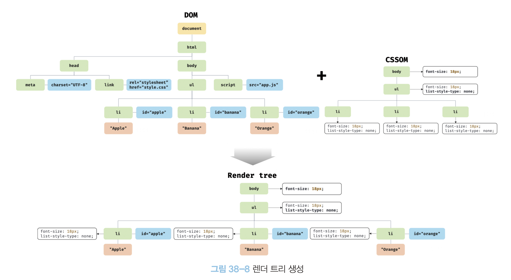

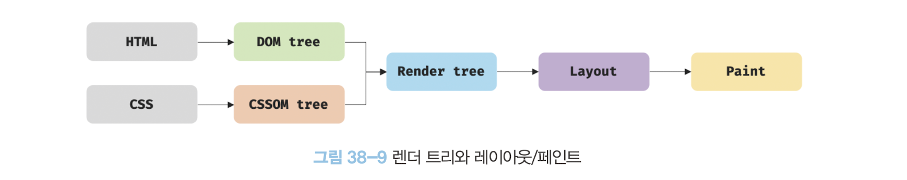

완성된 렌더 트리는 각 HTML의 요소의 레이아웃(위치와 크기)을 계산하는데 사용되며 브라우저 화면에 픽셀을 렌더링하는 페인팅 처리에 입력된다.

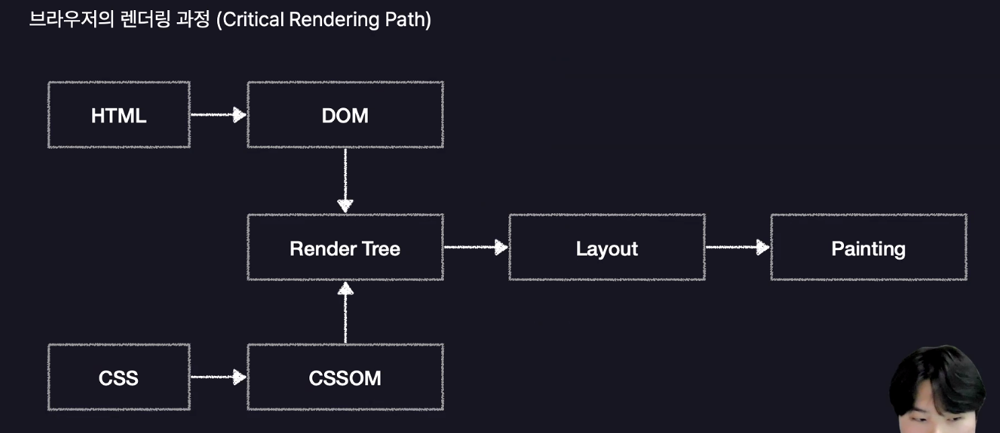

브라우저의 렌더링 과정은 아래와 같은 이유로 반복해서 실행될 수 있다.

- JS로 DOM 조작
- 뷰포트 크기 변경
- HTML 요소의 레이아웃 스타일 변경

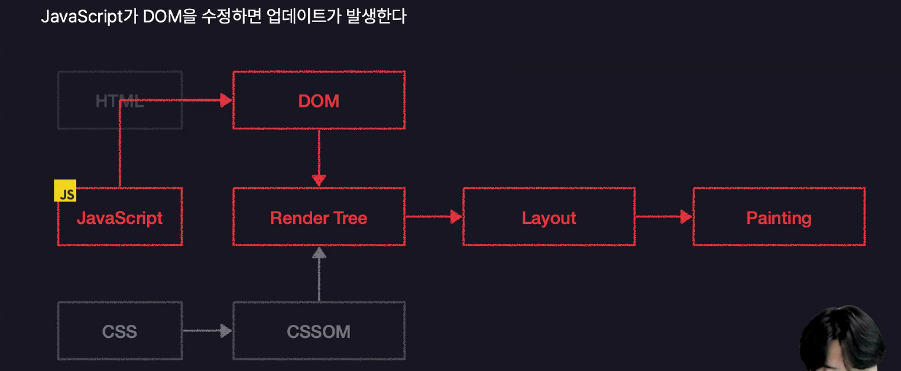

리렌더링은 비용이 많이 드는 작업이다.
DOM 수정을 최소화하는 등 주의를 통해 리렌더링이 빈번하게 발생하지 않도록 한다.

### 자바스크립트 파싱과 실행

자바스크립트 파싱과 실행은 브라우저의 렌더링 엔진이 아닌 자바스크립트 엔진이 처리한다.
자바스크립트 엔진이 렌더링 엔진으로부터 제어권을 넘겨받으면 JS 코드를 파싱하기 시작한다.
DOM과 CSSOM을 생성하듯이 AST(추상적 구문 트리)를 생성한다.
그리고 AST를 기반으로 인터프리터가 실행할 수 있는 바이트코드를 생성하여 실행한다.

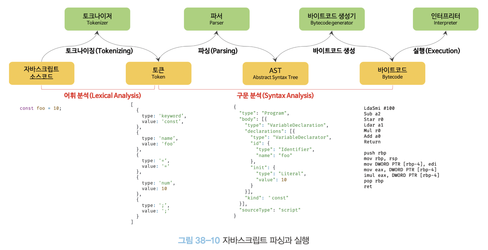

### 리플로우와 리페인트

만약 자바스크립트 코드에 DOM이나 CSSOM을 변경하는 DOM API가 사용된 경우 DOM이나 CSSOM이 변경된다. 이때 변경된 DOM과 CSSOM은 다시 렌더 트리로 결합되고 변경된 렌더 트리를 기반으로 레이아웃과 페인트 과정을 거쳐 다시 렌더링한다. 이를 리플로우, 리페인트라 한다.

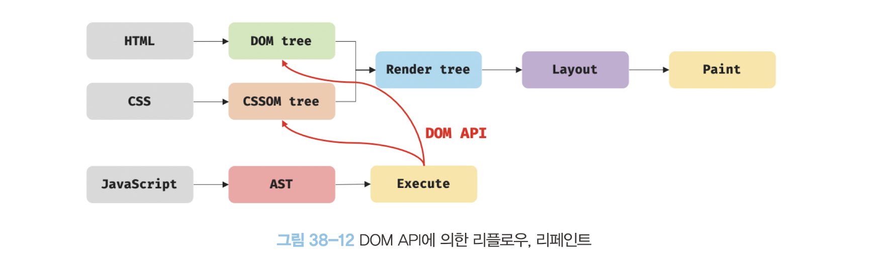

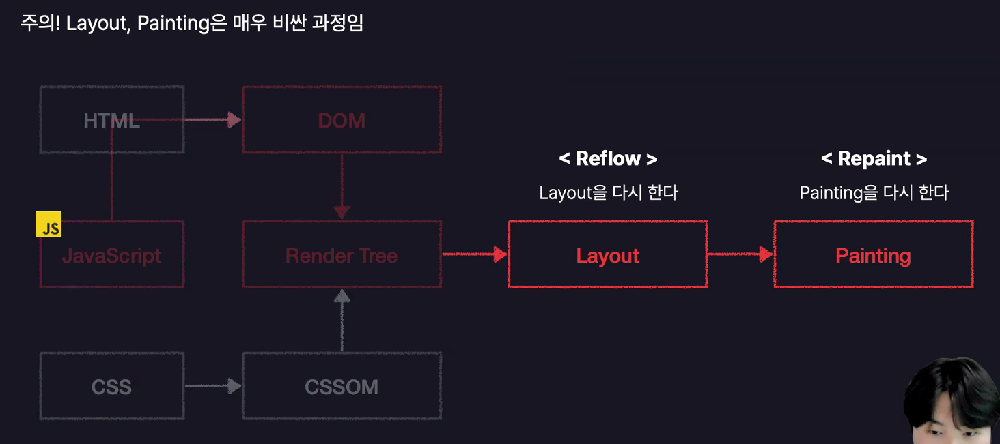

### 자바스크립트 파싱에 의한 HTML 파싱 중단

렌더링 엔진과 자바스크립트 엔진은 직렬적으로 파싱을 수행한다.

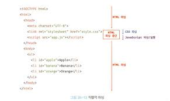

때문에 body 요소의 가장 아래에 자바스크립트를 위치시키는 것은 좋은 아이디어다.

1. DOM이 완성되지 않은 상태에서 JS가 DOM을 조작하면 에러가 발생할 수 있다.
2. 자바스크립트 로딩/파싱/실행으로 인해 HTML 요소들의 렌더링에 지장받는 일이 발생하지 않아 페이지 로딩 시간이 단축된다.

### script 태그의 async/defer 어트리뷰트

이처럼 자바스크립트 파싱에 의한 DOM 생성이 중단되는 문제를 근본적으로 해결하기 위해 script 태그에 async와 defer 어트리뷰트가 추가되었다.

#### async 어트리뷰트

HTML 파싱과 자바스크립트 파일의 로드가 병렬적으로 동시에 진행된다.
단 자바스크립트의 파싱과 실행은 로드가 완료된 직후 진행되며, 이때 HTML 파싱이 중단된다.
여러 개의 script 태그에 async 어트리뷰트를 지정하면 script 태그의 순서와 상관없이 로드가 완료되면 실행되므로 순서가 보장되지 않는다.

#### defer 어트리뷰트

HTML 파싱과 자바스크립트 파일의 로드가 병렬적으로 동시에 진행된다.
단 자바스크립트의 파싱과 실행은 HTML 파싱이 완료된 직후, 즉 DOM 생성이 완료된 직후 진행된다.

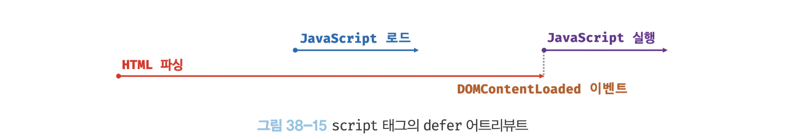
