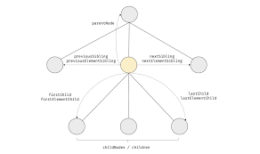
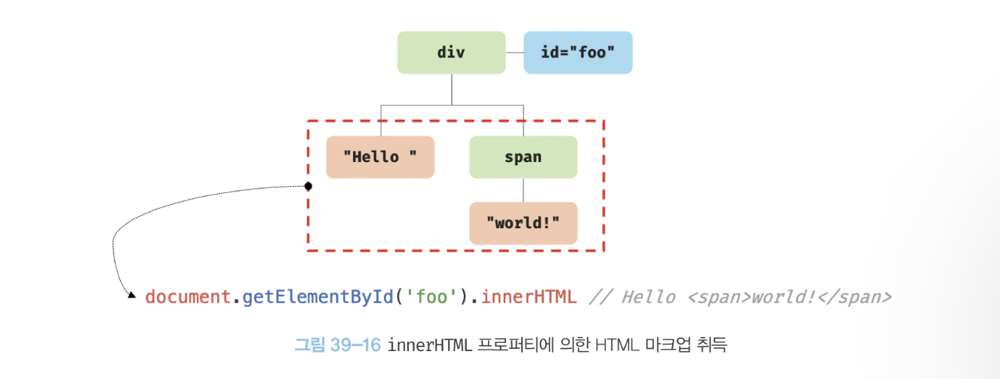
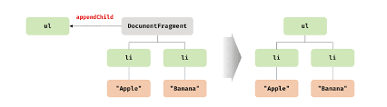
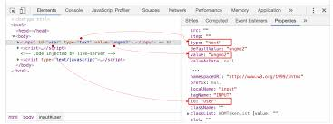

## 39. DOM

DOM은 HTML 문서의 계층적 구조와 정보를 표현하며 이를 제어할 수 있는 API, 즉 프로퍼티와 메서드를 제공하는 트리 자료구조다.

### 39.1 노드

#### HTML 요소와 노드 객체


#### 노드 객체의 타입

노드 객체는 총 12개의 종류가 있다. 가장 중요한 노드 타입 4가지를 알아보자.

1. 문서 노드: 문서 노드는 DOM 트리 최상위에 존재하는 루트 노드로서 document 객체를 가리킨다. (진입점 역할)
2. 요소 노드: HTML 요소를 가리키는 객체
3. 어트리뷰트 노드: HTML 요소의 어트리뷰트를 가리키는 객체
4. 텍스트 노드: HTML 요소의 텍스트를 가리키는 객체(리프 노드)

#### 노드 객체의 상속 구조

DOM을 구성하는 노드 객체는 표준 빌트인 객체가 아닌 호스트 객체다.
하지만 노드 객체도 자바스크립트 객체이므로 프로토타입에 의한 상속 구조를 갖는다.


#### 요소 노드 취득

요소 노드의 취득은 HTML 요소를 조작하는 시작점이다.

#### id를 이용한 요소 노드 취득

- Document.prototype.getElementById

#### 태그 이름을 이용한 요소 노드 취득

- Document.prototype.getElementsByTagName
- Element.prototype.getElementsByTagName

유사 배열 객체이며 이터러블인 HTMLCollection 객체를 반환한다.

#### class를 이용한 요소 노드 취득

- Document.prototype.getElementsByClassName
- Element.prototype.getElementsByClassName

HTMLCollection 객체를 반환한다.

#### CSS 선택자를 이용한 요소 노드 취득

- Document.prototype.querySelector
- Element.prototype.querySelector

하나의 요소 노드를 탐색하여 반환한다.

- Document.prototype.querySelectorAll
- Element.prototype.querySelectorAll

여러 개의 요소 노드 객체를 갖는 DOM 컬렉션 객체인 NodeList 객체를 반환한다.

<br>

_추가) HTMLCollection과 NodeList_
HTMLCollection과 NodeList 객체는 예상과 다르게 동작할 때가 있어 다루기 까다롭다.
안전하게 DOM 컬렉션을 사용하려면 배열로 변환하여 사용하는 것을 권장한다.

### 노드 탐색

Node, Element 인터페이스는 트리 탐색 프로퍼티를 제공한다.

- parentNode
- previousElementSibling, nextElementSibling
- children, firstElementChild, lastElementChild



#### 공백 텍스트 노드

HTML 요소 사이의 스페이스, 탭, 줄바꿈 등의 공백 문자는 텍스트 노드를 생성한다.
이를 공백 텍스트 노드라 한다.

#### 자식 노드 탐색

- Element.prototype.children: 자식 노드 중에서 **요소 노드만** 탐색하여 HTMLCollection에 담아 반환한다.
- Element.prototype.firstElementChild: 첫 번째 자식 요소 노드를 반환한다.
- Element.prototype.lastElementChild: 마지막 자식 요소 노드를 반환한다.

Node 프로퍼티의 경우 텍스트 노드까지 포함한다.

#### 부모 노드 탐색

- Node.prototype.parentNode

#### 형제 노드 탐색

- Element.prototype.previousElementSibling: 자신의 이전 형제 요소 노드를 반환한다.
- Element.prototype.nextElementSibling: 자신의 다음 형제 요소 노드를 반환한다.

Node 프로퍼티의 경우 텍스트 노드까지 포함한다.

### 요소 노드의 텍스트 조작

#### nodeValue

- Node.prototype.nodeValue

텍스트 노드의 텍스트
요소 노드의 nodeValue 프로퍼티를 참조하면 null을 반환한다.

#### textContent

- Node.prototype.textContent

요소 노드의 콘텐츠 영역 내의 텍스트를 모두 반환한다.
이때 HTML 마크업은 무시된다.

textContent 프로퍼티에 문자열을 할당하면 요소 노드의 모든 자식 노드가 제거되고 할당한 문자열이 텍스트로 추가된다.
이때 할당한 문자열에 HTML 마크업이 포함되어 있더라도 그대로 텍스트로 취급된다.

_innerText_

textContent 프로퍼티와 유사한 동작을 하는 innerText 프로퍼티가 있다.
CSS에 순종적인 이유로 성능이 느린 단점이 있기에 사용하지 않는 것이 좋다.

### DOM 조작

DOM 조작은 새로운 노드를 생성하여 DOM에 추가하거나 기존 노드를 삭제 또는 교체하는 것을 말한다. DOM 조작은 리플로우와 리페인트가 발생하는 원인이므로 주의해서 다뤄야 한다.

#### innerHTML

- Element.prototype.innerHTML

요소 노드의 콘텐츠 영역 내에 포함된 모든 HTML 마크업을 문자열로 반환한다.



innerHTML 프로퍼티에 문자열을 할당하면 요소 노드의 모든 자식 노드가 제거되고 할당한 문자열에 포함되어 있는 **HTML 마크업이 파싱**되어 요소 노드의 자식 노드로 DOM에 반영된다.

_XSS 크로스 사이트 스크립팅 공격_

사용자로부터 입력받은 데이터를 그대로 innerHTML 프로퍼티에 할당하는 것은 크로스 사이트 스크립팅 공격에 취약하다. HTML 마크업 내에 JS 악성 코드가 포함되어 있다면 파싱 과정에서 그대로 실행될 수 있다.

```js
document.getElementById("foo").innerHTML =
  "<script>alert(document.cookie)</script>";
```

HTML5는 innerHTML 프로퍼티로 삽입된 script 요소 내의 JS 코드를 실행하지 않는다.
하지만 script 요소 없이도 크로스 사이트 스크립팅 공격이 가능하다.

따라서 사용자로부터 데이터를 입력받는 경우 문자열을 노드의 콘텐츠로 할당하고 싶으면 textContent 프로퍼티를 사용하거나, script 내에서 노드를 생성하여 해당 노드를 추가하는 방식을 사용하는 것을 권장한다.

#### 노드 생성

- Document.prototype.createElement

태그 이름을 나타내는 문자열을 인수로 전달한다.
생성한 요소 노드는 DOM에 추가된 상태가 아니기 때문에 추가하는 처리가 별도로 필요하다.

_DocumentFragment 노드_

DocumentFragment 노드는 컨테이너 요소와 같이 자식 노드들의 부모 노드로서 별도의 서브 DOM을 구성하여 기존 DOM에 추가하기 위한 용도로 사용한다.
DocumentFragment 노드를 DOM에 추가하면 자신은 제거되고 자신의 자식 노드만 DOM에 추가된다.
이를 통해 불필요한 div 태그가 생성되는 것을 막을 수 있다.



#### 노드 삽입

- Element.prototype.append: 노드의 마지막 자식 노드로 추가
- Element.prototype.prepend: 노드의 첫 번째 자식 노드로 추가
- Element.prototype.after: 노드 뒤에 새로운 노드 추가 (형제 노드)
- Element.prototype.before: 노드 앞에 새로운 노드 추가 (형제 노드)

#### 노드 삭제

- Element.prototype.remove

### 어트리뷰트

#### 어트리뷰트 노드와 attributes 프로퍼티

HTML 요소는 여러 개의 어트리뷰트(속성)를 가질 수 있다.
HTML 문서가 파싱될 때 어트리뷰트는 어트리뷰트 노드로 변환되어 요소 노드의 형제 노드로 추가된다. (어트리뷰트 하나당 하나의 어트리뷰트 노드)
모든 어트리뷰트 노드의 참조는 NameNodeMap 객체에 담겨서 요소 노드의 attributes 프로퍼티에 저장된다.

```js
const { attributes } = document.getElementById("foo");
```

#### HTML 어트리뷰트 조작

- Element.prototype.getAttribute
- Element.prototype.setAttribute
- Element.prototype.removeAttribute

attributes 프로퍼티는 getter만 존재하는 읽기 전용 접근자 프로퍼티이다.
위의 메서드로 어트리뷰트 값을 취득하거나 변경하거나 삭제할 수 있다.

#### HTML 어트리뷰트 vs DOM 프로퍼티

요소 노드 객체에는 HTML 어트리뷰트에 대응하는 **프로퍼티**가 존재한다.



HTML 어트리뷰트는 중복해서 관리되고 있는 것처럼 보이지만 각자의 역할이 다르다.

- HTML 어트리뷰트: 초기 상태 저장
- DOM 프로퍼티: 최신 상태 저장

사용자가 input 요소에 "foo"라는 값을 입력한 경우를 생각해보자.
이때 input 요소 노드는 사용자의 입력에 변경된 최신 상태를 관리해야 하는 것은 물론, HTML 어트리뷰트로 지정한 초기 상태도 관리해야 한다.

다만 사용자 입력에 의한 상태 변화와 관계없는 어트리뷰트는 프로퍼티와 항상 동일한 값을 유지한다. id 어트리뷰트 값이 변하면 id 프로퍼티 값도 변하고 그 반대도 마찬가지다.

```js
const input = document.getElementById("user");
input.id = "foo";

console.log(input.getAttribute("id")); // foo
```

이처럼 사용자 입력에 의한 상태 변화와 관계있는 DOM 프로퍼티만 최신 상태 값을 관리하고 그 외의 어트리뷰트와 DOM 프로퍼티는 항상 동일한 값으로 연동한다.

#### data 어트리뷰트와 dataset 프로퍼티

요소 노드에 표준으로 지정되지 않는 새로운 속성을 지정할 수 있다.

```html
<button class="btn" status="대기중">대기중</button>
```

이러한 속성을 비표준 속성이라 한다.
비표준 속성을 사용하여 코드를 작성한 경우 나중에 그 속성이 표준으로 등록되면 문제가 발생할 수 있다.

`data-*`: 비표준 속성을 사용하기 위해 미리 약속된 방식을 통해 안전하게 작성할 수 있다.

`HTMLElement.dataset` 프로퍼티로 data 어트리뷰트의 정보를 제공하는 객체를 취득할 수 있다.
이 객체는 data- 접두사 다음에 붙인 임의의 이름을 카멜 케이스로 변환한 프로퍼티를 가지고 있다. 이 프로퍼티로 data 어트리뷰트의 값을 취득하거나 변경할 수 있다.

### 스타일

#### 인라인 스타일 조작

- HTMLElement.prototype.style

style 프로퍼티를 참조하면 CSSStyleDeclaration 타입의 객체를 반환한다.
이 객체의 프로퍼티는 카멜 케이스를 따른다.

```js
element.style.backgrounColor = "red";
element.style["background-color"] = "red";
```

단위 지정이 필요한 CSS 프로퍼티의 값은 반드시 단위를 지정해야 한다.
단위를 생략하면 해당 CSS 프로퍼티는 적용되지 않는다.

#### 클래스 조작

class 어트리뷰트를 조작하여 스타일을 변경할 수 있다.

- Element.prototype.className: 해당 요소에 class 어트리뷰트 문자열을 반환
- Element.prototype.classList: class 어트리뷰트의 정보를 담은 DOMTokenList 객체를 반환한다.
  - add: 인수로 전달한 1개 이상의 문자열을 class 어트리뷰트 값으로 추가한다.
  - remove: 인수로 전달한 1개 이상의 문자열과 일치하는 클래스를 삭제한다.
  - replace: class 어트리뷰트에서 첫 번째 인수로 전달한 문자열을 두 번째 인수로 전달한 문자열로 변경한다.
  - toggle: 인수로 전달한 문자열과 일치하는 클래스가 존재하면 제거하고, 없으면 추가한다.

#### 요소에 적용되어 있는 CSS 스타일 참조

- window.getComputedStyle

첫 번째 인수로 전달한 요소 노드에 적용되어 있는 모든 스타일이 조합되어 최종적으로 적용된 스타일을 CSSStyleDeclaration 객체에 담아 반환한다.

두 번째 인수로 `:after`, `:before`와 같은 의사 요소를 지정하는 문자열을 전달할 수 있다.
