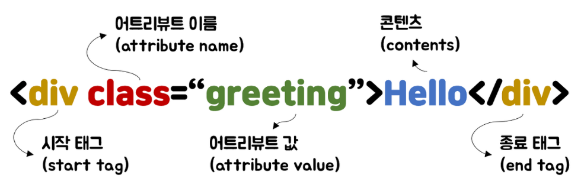
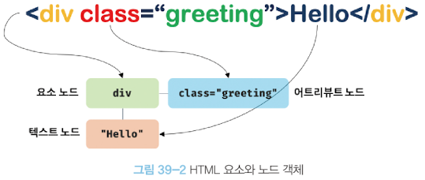
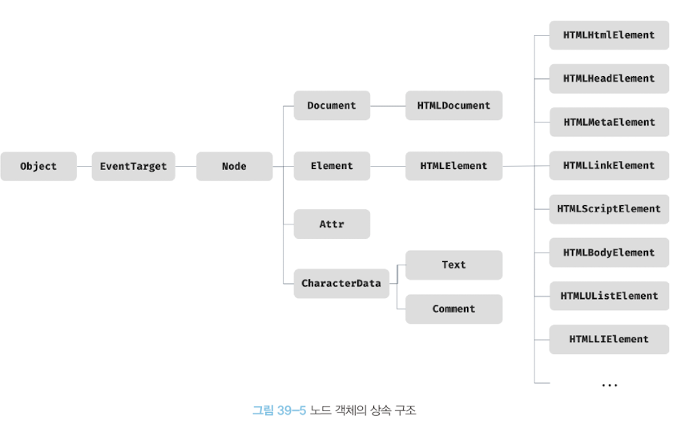
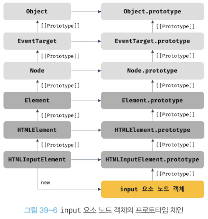

## 39. DOM

DOM은 HTML 문서의 계층적 구조와 정보를 표현하며 이를 제어할 수 있는 API, 즉 프로퍼티와 메서드를 제공하는 트리 자료구조다.

### 39.1 노드

#### HTML 요소와 노드 객체

#### 노드 객체의 타입

노드 객체는 총 12개의 종류가 있다. 가장 중요한 노드 타입 4가지를 알아보자.

1. 문서 노드: 문서 노드는 DOM 트리 최상위에 존재하는 루트 노드로서 document 객체를 가리킨다. (진입점 역할)
2. 요소 노드: HTML 요소를 가리키는 객체
3. 어트리뷰트 노드: HTML 요소의 어트리뷰트를 가리키는 객체
4. 텍스트 노드: HTML 요소의 텍스트를 가리키는 객체(리프 노드)

#### 노드 객체의 상속 구조

DOM을 구성하는 노드 객체는 표준 빌트인 객체가 아닌 호스트 객체다.
하지만 노드 객체도 자바스크립트 객체이므로 프로토타입에 의한 상속 구조를 갖는다.

#### 요소 노드 취득

요소 노드의 취득은 HTML 요소를 조작하는 시작점이다.

#### id를 이용한 요소 노드 취득

- Document.prototype.getElementById

#### 태그 이름을 이용한 요소 노드 취득

- Document.prototype.getElementsByTagName
- Element.prototype.getElementsByTagName

유사 배열 객체이며 이터러블인 HTMLCollection 객체를 반환한다.

#### class를 이용한 요소 노드 취득

- Document.prototype.getElementsByClassName
- Element.prototype.getElementsByClassName

HTMLCollection 객체를 반환한다.

#### CSS 선택자를 이용한 요소 노드 취득

- Document.prototype.querySelector
- Element.prototype.querySelector

하나의 요소 노드를 탐색하여 반환한다.

- Document.prototype.querySelectorAll
- Element.prototype.querySelectorAll

여러 개의 요소 노드 객체를 갖는 DOM 컬렉션 객체인 NodeList 객체를 반환한다.

 

_추가) HTMLCollection과 NodeList_
HTMLCollection과 NodeList 객체는 예상과 다르게 동작할 때가 있어 다루기 까다롭다.
안전하게 DOM 컬렉션을 사용하려면 배열로 변환하여 사용하는 것을 권장한다.
