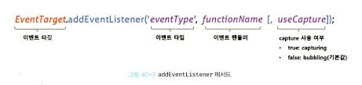
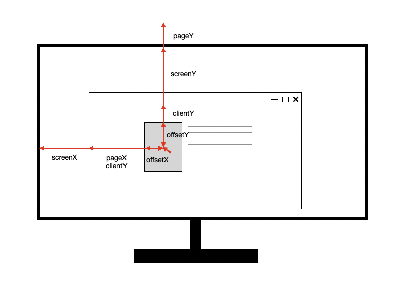
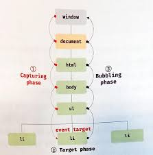

## 40. 이벤트

### 이벤트 드리븐 프로그래밍

이벤트 핸들러: 이벤트가 발생했을 때 호출될 함수
이벤트 드리븐 프로그래밍: 프로그램의 흐름을 이벤트 중심으로 제어하는 프로그래밍 방식

### 이벤트 타입

이벤트 타입: 이벤트의 종류를 나타내는 문자열

#### 마우스 이벤트

- click
- dblclick
- mousedown / mouseup
- mousemove
- mouseover / mouseout: 버블링된다.
- mouseenter / mouseleave: 버블링되지 않는다.

#### 키보드 이벤트

- keydown, keyup
- keypress: 문자 키를 눌렀을 때 연속적으로 발생한다.

#### 포커스 이벤트

- focus / blur : 버블링되지 않는다.
- focusin / focusout: 버블링된다.

#### 폼 이벤트

- submit
- reset

#### 값 변경 이벤트

- input: input 요소의 값이 입력되었을 때
- change: input 요소가 포커스를 잃었을 때

사용자가 입력을 하고 있을 때는 input 이벤트 발생
사용자가 입력을 종료했을 때 change 이벤트 발생

#### DOM 뮤테이션 이벤트

- DOMContentLoaded: HTML 문서의 로드와 파싱이 완료되어 DOM 생성이 완료되었을 때

#### 뷰 이벤트

- resize: 윈도우 크기를 리사이즈할 때 연속적으로 발생
- scroll: 스크롤할 때 연속적으로 발생

#### 리소스 이벤트

- load: DOMContentLoaded 이벤트가 발생한 후, 모든 리소스의 로딩이 완료되었을 때
- unload: 새로운 웹페이지를 요청한 경우
- abort / error

### 이벤트 핸들러 등록

이벤트 핸들러를 등록하는 방법은 3가지다.

#### 이벤트 핸들러 어트리뷰트 방식

HTML 요소의 어트리뷰트 중에는 이벤트에 대응하는 이벤트 핸들러 어트리뷰트가 있다.
이벤트 핸들러 어트리뷰트 값으로 함수 호출문 등의 문을 할당하면 이벤트 핸들러가 등록된다.

```html
<button onclick="sayHi('lee')">Click me</button>
```

이벤트 핸들러에 인수를 전달하기 위해 함수 참조가 아닌 문을 등록한다.
위의 HTML은 파싱되어 다음과 같은 함수를 암묵적으로 생성한다.

```js
function onclick(event) {
  sayHi("lee");
}
```

_함수 몸체를 전달하는 것이 아닌 함수 안 내용을 전달한다._

#### 이벤트 핸들러 프로퍼티 방식

DOM 노드 객체는 이벤트 핸들러 프로퍼티를 가지고 있다.
이벤트 핸들러 프로퍼티에 함수를 바인딩하면 이벤트 핸들러가 등록된다.

하나의 이벤트 핸들러만 바인딩할 수 있다는 단점이 있다.

#### addEventListener 메서드 방식



마지막 매개변수에는 이벤트를 **캐치**할 이벤트 전파 단계를 지정한다.

addEventListener 메서드는 하나 이상의 이벤트 핸들러를 등록할 수 있다.
이때 이벤트 핸들러는 등록된 순서대로 호출된다.

### 이벤트 핸들러 제거

- EventTarget.prototype.removeEventListener

removeEventListener 메서드에 전달할 인수는 addEventListener 메서드와 동일하다.
단 두 메서드의 인수가 일치하지 않으면 이벤트 핸들러가 제거되지 않는다.

### 이벤트 객체

이벤트가 발생하면 이벤트에 관련한 다양한 정보를 담고 있는 이벤트 객체가 동적으로 생성된다.
생성된 이벤트 객체는 이벤트 핸들러의 첫 번째 인수로 전달된다.

브라우저가 이벤트 핸들러를 **호출**할 때 이벤트 객체를 인수로 전달한다.

#### 이벤트 객체의 공통 프로퍼티

- type: 이벤트 타입(string)
- target: 이벤트를 **발생**시킨 DOM 요소
- currentTarget: 이벤트 핸들러가 **바인딩된** DOM 요소
- eventPhase: 이벤트 전파 단계(캡처링 단계, 타깃 단계, 버블링 단계)
- bubbles: 이벤트를 버블링으로 전파하는지 여부
- cancelable: preventDefault 메서드로 기본 동작을 취소할 수 있는지 여부
- defaultPrevented: preventDefault 메서드로 이벤트를 취소했는지 여부
- isTrusted: 사용자의 행위에 의해 발생한 이벤트인지 여부
- timeStamp: 이벤트가 발생한 시각

#### 마우스 정보 취득



- screenX / screenY: 모니터 화면을 기준으로 한 좌표 표시
- pageX / pageY: 전체 문서를 기준으로 한 좌표 표시, 특정 지점의 pageY 좌표값은 스크롤될 때마다 변경 될 것이다.
- clientX / clientY: 뷰포트 기준으로 좌표를 표시, 스크롤하더라도 값은 동일하다. (절대적 위치)
- offsetX / offsetY: DOM node를 기준으로 좌표 표시

참고 자료: https://velog.io/@klloo/JavaScript-%EB%A7%88%EC%9A%B0%EC%8A%A4-%ED%8F%AC%EC%9D%B8%ED%84%B0-%EC%A2%8C%ED%91%9Cscreen-page-client-offset

### 이벤트 전파

DOM 요소 노드에서 발생한 이벤트는 DOM 트리를 통해 전파된다.



이벤트는 캡처링 단계 -> 타깃 단계 -> 버블링 단계로 전파된다.
어디서 이벤트를 캐치하는지에 따라 이벤트 타깃이 결정된다.

### 이벤트 위임

상위 DOM 요소에 이벤트 핸들러를 등록하면 여러 개의 하위 DOM 요소에 이벤트 핸들러를 등록할 필요가 없다. 이를 이벤트 위임이라고 한다.

이벤트 위임을 할 때 주의해야할 사항은 하위 요소뿐만 아니라 자기 자신도 이벤트의 대상이라는 것이다. 따라서 기대한 DOM 요소에 대해서만 이벤트가 발생하도록 이벤트 타깃을 검사할 필요가 있다.

```js
...
if(!target.matches("#fruits > li")) return;
...
```

### DOM 요소의 기본 동작의 조작

#### DOM 요소의 기본 동작 중단

이벤트 객체의 preventDefault 메서드는 DOM 요소의 기본 동작을 중단시킨다.

이벤트 객체의 stopPropagation 메서드는 이벤트 전파를 중지시킨다.

```
이벤트 전파 단계와 stopPropagation

Short answer: The order is:

1. Capture (down)
2. Target
3. Bubble (up).

If you call e.stopPropagation() in the capture phase (by setting the addEventListener()'s 3rd argument to true), it stops at 1, so 2 & 3 cannot receive it.

If you call e.stopPropagation() in the bubble phase (by setting the addEventListener()'s 3rd argument to false or just not assign it), the 1 & 2 already complete, so it just prevents the event from bubbling up from the level where you call stopPropagation().
```

참고 자료: https://stackoverflow.com/questions/12462721/does-stoppropgation-stop-the-event-from-propagating-in-the-capture-phase

### 이벤트 핸들러 내부의 this

이벤트 핸들러 프로퍼티 방식의 경우 다음과 같이 이벤트 핸들러를 바인딩해준다.

```js
button.onclick = function (e) {
  console.log(this);
};
```

button 객체의 onclick 메서드로 이벤트 핸들러를 할당하고 있다.
this 바인딩은 함수 호출 방식에 의해 결정된다.
현재 객체의 메서드로 호출되고 있으므로 this에는 button 객체가 할당된다.

addEventListener에 전달하는 이벤트 핸들러도 마찬가지로
함수 내부의 this는 이벤트를 바인딩한 DOM 요소를 가리킨다.

<span style="color:red;">주의 사항</span>
화살표 함수로 정의한 이벤트 핸들러 내부의 this는 이벤트를 바인딩한 DOM 요소가 아닌 상위 스코프의 this를 가리킨다. (렉시컬 스코프)
