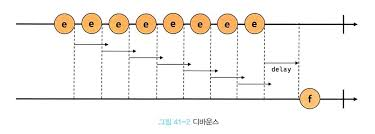
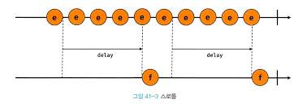
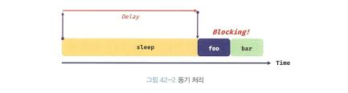
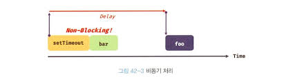
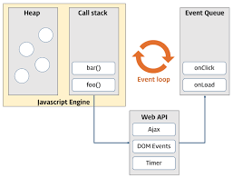

## 41. 타이머

### 호출 스케줄링

함수를 호출하지 않고 일정 시간이 경과된 이후에 호출되도록 함수 호출 예약하려면 타이머 함수를 사용한다.
이를 호출 스케줄링이라 한다.
타이머 함수는 빌트인 함수가 아닌 호스트 객체다.

### 타이머 함수

clearTimeout / clearInterval

setTimeout / setInterval 함수는 생성된 타이머를 식별할 수 있는 고유한 타이머 id를 반환한다.
반환된 타이머 id를 clearTimeout 함수의 인수로 전달하여 타이머를 취소할 수 있다.

### 디바운스와 스로틀

scroll, resize, input, mousemove, mouseover와 같은 이벤트는 짧은 시간 간격으로 연속해서 발생한다.
이러한 이벤트에 바인딩한 이벤트 핸들러는 과도하게 호출되어 성능에 문제를 일으킬 수 있다.

디바운스와 스로틀은 짧은 시간 간경으로 연속해서 발생하는 이벤트를 그룹화해서 과도한 이벤트 핸들러의 호출을 방지하는 프로그래밍 기법이다.

#### 디바운스

디바운스는 짧은 시간 간격으로 이벤트가 연속해서 발생하면 이벤트 핸들러를 호출하지 않다가
**일정 시간이 경과한 이후**에 이벤트 핸들러가 호출되도록 한다.

```js
const debounce = (cb, delay) => {
  let timerId;

  // debounce 함수는 timerId를 기억하는 클로저를 반환한다.
  return (event) => {
    if (timerId) clearTimeout(timerId);
    timerId = setTimeout(cb, delay, event);
  };
};
```

delay가 경과하기 이전에 이벤트가 발생하면 이전 타이머를 취소하고 새로운 타이머를 재설정한다.



실무에서는 Underscore의 debounce나 Lodash의 debounce 함수를 사용하는 것을 권장한다.

#### 스로틀

스로틀은 짧은 시간 간격으로 이벤트가 연속해서 발생하더라도 **일정 시간 간격**으로
이벤트 핸들러가 호출되도록 한다.

```js
const throttle = (cb, delay) => {
  let timerId;

  // throttle 함수는 timerId를 기억하는 클로저를 반환한다.
  return (event) => {
    if (timerId) return;
    timerId = setTimeout(
      () => {
        cb(event);
        timerId = null;
      },
      delay,
      event
    );
  };
};
```

delay 시간 간격으로 콜백 함수가 호출된다.



실무에서는 Underscore의 throttle나 Lodash의 throttle 함수를 사용하는 것을 권장한다.

<br>

## 42. 비동기 프로그래밍

### 동기 처리와 비동기 처리

자바스크립트 엔진은 단 하나의 실행 컨텍스트 스택을 가진다.
이는 함수를 실행할 수 있는 창구가 단 하나이며, 2개 이상의 함수를 동시에 실행할 수 없다는 것을 의미한다.

이처럼 자바스크립트 엔진은 한 번에 하나의 태스크만 실행할 수 있는 싱글 스레드 방식으로 동작한다.
싱글 스레드 방식은 한 번에 하나의 태스크만 실행할 수 있기에 처리에 시간이 걸리는 태스크를 실행하는 경우 블로킹이 발생한다.



이처럼 현재 실행 중인 태스크가 종료할 때까지 다음에 실행될 태스크가 대기하는 방식을 동기 처리라고 한다.

반면에 현재 실행 중인 태스크가 **종료되지 않은 상태**라 해도 다음 태스크를 곧바로 실행하는 방식을 비동기 처리라고 한다.



타이머 함수, HTTP 요청, 이벤트 핸들러는 비동기 처리 방식으로 동작한다.

### 이벤트 루프와 태스크 큐

자바스크립트는 싱글 스레드로 동작한다.
하지만 브라우저가 동작하는 것을 살펴보면 많은 태스크가 동시에 처리되는 것처럼 느껴진다.
이처럼 자바스크립트의 동시성을 지원하는 것이 바로 이벤트 루프다.
이벤트 루프는 브라우저에 내장되어 있는 기능 중 하나다.



대부분의 자바스크립트 엔진은 2개의 영역으로 구분할 수 있다.

- 콜 스택: 실행 컨텍스트 스택
- 힙: 객체가 저장되는 메모리 공간. 실행 컨텍스트는 힙에 저장된 객체를 참조
- 태스크 큐: 비동기 함수의 콜백 함수나 이벤트 핸들러가 일시적으로 보관되는 영역
- 이벤트 루프
  콜 스택에 현재 실행 중인 실행 컨텍스트가 있는지, 태스크 큐에 대기중인 함수가 있는지 반복해서 확인한다.
  만약 콜 스택이 비어 있고 태스크 큐에 대기 중인 함수가 있다면 이벤트 루프는 순차적으로 태스크 큐에 대기 중인 함수를 콜 스택으로 이동시킨다.

_콜백 함수를 태스크 큐에 푸시하는 것은 브라우저의 역할이다._
