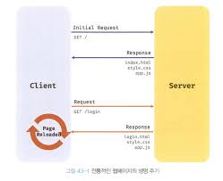
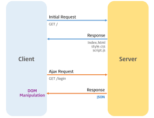

## 43. Ajax

### Ajax란?

Ajax란 자바스크립트를 사용하여 브라우저가 서버에게 **비동기 방식**으로 데이터를 요청하고, 응답한 데이터를 수신하여 웹페이지를 **동적**으로 갱신하는 프로그래밍 방식을 말한다.

Ajax는 브라우저에서 제공하는 Web API인 XMLHttpRequest 객체를 기반으로 동작한다.
XMLHttpRequest는 비동기 통신을 위한 메서드와 프로퍼티를 제공한다.

#### 전통적인 방식

1. 이전 웹페이와 차이가 없어 변경할 필요가 없는 부분까지 포함된 완전한 HTML을 서버로부터 매번 다시 전송받기 때문에 불필요한 **데이터 통신**이 발생한다.
2. 처음부터 다시 렌더링한다. 이로 인해 화면이 깜박이는 현상이 발생한다.
3. 클라이언트와 서버와의 통신이 **동기 방식**으로 동작하기 때문에 서버로부터 응답이 있을 때까지 다음 처리는 블로킹된다.

#### Ajax 방식

1. 변경할 부분을 갱신하는데 필요한 데이터만 서버로부터 전송받기 때문에 불필요한 데이터 통신이 발생하지 않는다.
2. 변경할 필요가 없는 부분은 다시 렌더링하지 않는다. 자바스크립트로 DOM 조작을 한다.
3. 클라이언트와 서버와의 통신이 비동기 방식으로 동작하기 때문에 서버에게 요청을 보낸 이후 블로킹이 발생하지 않는다.

### JSON

JSON은 클라이언트와 서버 간의 HTTP 통신을 위한 텍스트 데이터 포맷이다.

**JS와 JSON 문법의 차이**

1. JSON에서는 문자열에 반드시 큰따옴표로 묶어야 한다. (작은따옴표 사용 불가)
2. JSON에서는 undefined, NaN, Infinity 값을 사용할 수 없다.
   (JS에서만 사용이 국한되지 않기 때문에)
3. JSON은 코드가 아니기 때문에 주석을 포함시킬 수 없다.

#### JSON.stringify

객체를 JSON 포맷의 문자열로 변환한다.
클라이언트가 서버로 객체를 전송하려면 객체를 문자열화해야 하는데 이를 직렬화라 한다.

#### JSON.parse

JSON 포맷의 문자열을 객체로 변환한다.
서버로부터 받은 문자열을 사용하려면 객체화해야 하는데 이를 역직렬화라 한다.

 

## 42. REST API

REST: HTTP를 기반으로 클라이언트가 서버의 리소스에 접근하는 방식을 규정한 **아키텍처**
REST API: REST를 기반으로 서비스 API를 구현한 것
RESTful: REST의 기본 원칙을 성실히 지킨 서비스 디자인

### REST API의 구성

REST API는 자원, 행위, 표현의 3가지 요소로 구성된다.

- 자원: URI(엔드포인트)
- 행위: HTTP 요청 메서드
- 표현: 페이로드(자원에 대한 행위의 구체적 내용)

REST API만으로 HTTP 요청의 내용을 이해할 수 있다.

### REST API 설계 원칙

1. URI는 리소스를 표현하는데 집중한다.
2. 행위에 대한 정의는 HTTP 요청 메서드를 통해 한다.

| HTTP 요청 메서드 | 목적             | 페이로드 |
| ---------------- | ---------------- | -------- |
| GET              | 리소스 취득      | X        |
| POST             | 리소스 생성      | O        |
| PUT              | 리소스 전체 수정 | O        |
| PATCH            | 리소스 일부 수정 | O        |
| DELETE           | 리소스 삭제      | X        |
