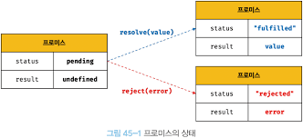

## 45. 프로미스

비동기 처리를 순차적으로 해야할 때 전통적인 콜백 패턴은 콜백 헬 때문에 가독성과 에러 처리 부분에서 문제가 있다.

ES6에서는 비동기 처리를 위한 또 다른 패턴으로 프로미스를 도입했다.
프로미스는 전통적인 콜백 패턴이 가진 단점을 보완하며 비동기 처리 시점을 명확하게 표현할 수 있다는 장점이 있다.

### 비동기 처리를 위한 콜백 패턴의 단점

#### 콜백 헬

비동기 함수는 비동기 처리 결과를 외부에 반환할 수 없고, 상위 스코프의 변수에 할당하면 기대한 대로 동작하지 않는다.
따라서 비동기 함수의 처리 결과에 대한 후속 처리는 비동기 함수 내부에서 수행해야 한다.

이처럼 콜백 함수 호출이 중첩되어 복잡도가 높아지는 현상이 발생하는 것을 콜백 헬이라 한다.

#### 에러 처리의 한계

```js
try {
  setTimeout(() => {
    throw new Error("Error");
  }, 1000);
} catch (error) {
  console.error(error);
}
```

이 에러는 catch 코드 블록에서 캐치되지 않는다.

에러는 호출자 방향으로 전파된다. 즉 콜 스택의 아래 방향으로 전파된다.
하지만 setTimeout 함수의 콜백 함수를 호출한 것은 setTimeout 함수가 아니다.
따라서 catch 블록에서 캐치되지 않는다.

### 프로미스의 생성

Promise는 호스트 객체가 아닌 표준 빌트인 객체다.

Promise 생성자 함수는 **비동기 처리를 수행할 콜백 함수**를 인수로 전달받는데
이 콜백 함수는 resolve와 reject 함수를 인수로 전달 받고, 즉시 실행된다.
(Promise 객체를 반환하기도 전에 호출됨)

| 프로미스의 상태 정보 | 의미                                  | 상태 변경 조건                   |
| -------------------- | ------------------------------------- | -------------------------------- |
| pending              | 비동기 처리가 아직 수행되지 않은 상태 | 프로미스가 생성된 직후 기본 상태 |
| fulfilled            | 비동기 처리가 수행된 상태(성공)       | resolve 함수 호출                |
| rejected             | 비동기 처리가 수행된 상태(실패)       | reject 함수 호출                 |

- 비동기 처리 성공: resolve 함수를 호출해 fulfiled 상태로 변경, resolve 함수의 인수는 상태 결과값이 됨.
- 비동기 처리 실패: reject 함수를 호출해 rejected 상태로 변경, reject 함수의 인수는 상태 결과값이 됨.



> 프로미스는 비동기 처리 상태와 처리 결과를 관리하는 객체다.

### 프로미스의 후속 처리 메서드

프로미스의 비동기 처리 상태가 변화하면 후속 처리 메서드에 인수로 전달한 콜백 함수가 선택적으로 호출된다.
모든 후속 처리 메서드는 프로미스를 반환하며, 비동기로 동작한다.

#### Promise.prototype.then

then 메서드는 두 개의 콜백 함수를 인수로 전달받는다.

- 첫 번째 콜백 함수는 프로미스가 fulfilled 상태가 되면 호출된다.
  이때 콜백 함수는 프로미스의 비동기 처리 결과를 인수로 전달받는다.
- 두 번째 콜백 함수는 프로미스가 rejected 상태가 되면 호출된다.
  이때 콜백함수는 프로미스의 에러 객체를 인수로 전달받는다.

then 메서드는 언제나 Promise 객체를 반환하는데
이때 Promise 객체는 then 메서드의 콜백 함수가 반환하는 값에 따라 달라진다.

1. 실행된 콜백이 값을 리턴하는 경우
   - Promise 객체: then 메서드가 리턴하는 Promise 객체가 콜백 함수가 리턴하는 Promise 객체와 동기화된다.
   - Promise 객체 이외의 값: then 메서드가 리턴하는 Promise 객체는 fulfiled 상태가 되고 상태 결과값으로 그 값을 갖는다.
   - 값을 리턴하지 않는 경우: fulfiled 상태가 되고 undefined를 상태 결과값으로 갖는다.
2. 실행된 콜백 내부에서 에러가 발생하는 경우
   - rejected 상태가 되고 작업 실패 정보로 해당 에러 객체를 갖는다.
3. 아무런 콜백이 실행되지 않는 경우
   - 이전 Promise 객체와 동일한 상태와 결과를 갖게 된다.
     (catch 메서드를 마지막에 위치할 수 있는 이유)

#### Promise.prototype.catch

catch 메서드는 한 개의 콜백 함수를 인수로 전달받는다.
`then(undefined, onRejected)`와 동일하게 동작한다.

#### Promise.prototype.finally

finally 메서드는 한 개의 콜백 함수를 인수로 전달받는다.
프로미스의 상태와 상관없이 무조건 한 번 호출된다.
마찬가지로 언제나 프로미스를 반환한다.

### 프로미스의 정적 메서드

#### Promise.resolve / Promise.reject

이미 존재하는 값을 래핑하여 프로미스를 생성하기 위해 사용한다.

```js
const promise1 = Promise.resolve([1, 2, 3]);
const promise2 = new Promise((resolve) => resolve([1, 2, 3]));
// 두 프로미스는 동일하게 동작한다.
```

#### Promise.all

여러 개의 비동기 처리를 모두 병렬 처리할 때 사용한다.

```js
const request1 = () =>
  new Promise((resolve) => setTimeout(() => resolve(1), 3000));
const request2 = () =>
  new Promise((resolve) => setTimeout(() => resolve(2), 2000));
const request3 = () =>
  new Promise((resolve) => setTimeout(() => resolve(3), 1000));

Promise.all([request1(), request2(), request3()])
  .then(console.log)
  .catch(console.error);
```

Promise.all 메서드는 프로미스를 요소로 갖는 배열 등의 이터러블을 인수로 전달받는다.
그리고 전달받은 모든 프로미스가 모두 fulfilled 상태가 되면 모든 처리 결과를 배열에 저장해 새로운 프로미스를 반환한다.

모든 처리에 걸리는 시간은 가장 늦게 fulfilled 상태가 되는 첫 번째 프로미스의 처리 시간인 3초보다 조금 더 소요된다.
그러나 배열 중 프로미스가 하나라도 rejected 상태가 되면 즉시 종료한다.

#### Promise.race

Promise.all 메서드와 동일하게 프로미스를 요소로 갖는 배열 등의 이터러블을 인수로 전달받는다.
가장 먼저 fulfilled 상태가 된 프로미스의 처리 결과를 resolve하는 새로운 프로미스를 반환한다.

#### Promise.allSettled

프로미스를 요소로 갖는 배열 등의 이터러블을 인수로 전달받는다.
전달받은 프로미스가 모두 **settled**(fulfilled or rejected) 상태가 되면 처리 결과를 배열로 반환한다.

### 마이크로태스크 큐

프로미스의 후속 처리 메서드의 콜백 함수는 태스크 큐가 아닌 마이크로태스크 큐에 저장된다.
마이크로태스크 큐는 태스크 큐보다 우선순위가 높다.

### fetch

fetch 함수는 XMLHttpRequest 객체와 마찬가지로 HTTP 요청 전송 기능을 제공하는 클라이언트 사이드 Web API다. fetch 함수는 XMLHttpRequest 객체보다 사용법이 간단하고 프로미스를 지원하는 장점이 있다.

fetch 함수는 HTTP 응답을 나타내는 Response 객체를 래핑한 Promise 객체를 반환한다.
