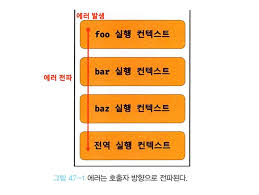

## 47. 에러 처리

예외 처리의 필요성: JS 인터프리터가 한 줄씩 실행할 때 에러가 발생하면 그 순간 프로그램 자체가 멈춘다.

### try... catch... finally 문

try catch 문을 사용하여 프로그램이 종료되는 것을 막을 수 있다.

```js
try {
  // 코드
} catch (error) {
  // 에러가 발생했을 때 동작할 코드
}
```

### Error 객체

Error 생성자 함수는 에러 객체를 생성한다.
Error 생성자 함수에는 에러를 상세히 설명하는 에러 메시지를 인수로 전달할 수 있다.

자바스크립트는 Error 생성자 함수를 포함해 7가지의 에러 객체를 생성할 수 있는 Error 생성자 함수를 제공한다.
SyntaxError, ReferenceError, TypeError, RangeError, URIError, EvalError 생성자 함수가 생성한 에러 객체의 프로토타입은 모두 Error.prototype을 상속받는다.

| 생성자 함수    | 인스턴스                                                               |
| -------------- | ---------------------------------------------------------------------- |
| Error          | 일반적 에러 객체                                                       |
| SyntaxError    | JS 문법에 맞지 않는 문을 해석할 때 발생하는 에러 객체                  |
| ReferenceError | 참조할 수 없는 식별자를 참조했을 때 발생하는 에러 객체                 |
| TypeError      | 피연산자 또는 인수의 데이터 타입이 유효하지 않을 때 발생하는 에러 객체 |

### throw 문

Error 생성자 함수로 에러 객체를 생성한다고 에러가 발생하는 것은 아니다.
에러를 발생시키려면 throw 문으로 에러 객체를 던져야 한다.

### 에러의 전파

에러는 호출자 방향으로 전파된다.
즉 콜 스택의 아래 방향으로 전파된다.



주의할 것은 비동기 함수인 타이머 함수나 프로미스의 후속 처리 메서드의 콜백 함수는 **호출자가 없다**는 것이다.
콜 스택에 푸시된 콜백 함수의 실행 컨텍스트는 콜 스택의 가장 하부에 존재하게 된다.
따라서 에러를 전파할 호출자가 존재하지 않는다.
