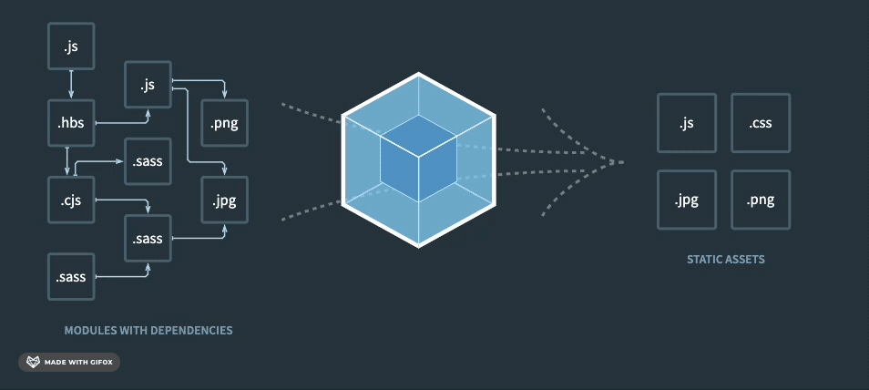

## 49. 빌드 / 트랜스파일링 / 번들링

### 빌드

개발 완료된 앱을 배포하기 위해 하나의 폴더로 구성하여 준비하는 작업이다.
프론트엔드 개발에선 브라우저가 해석할 수 있고 웹 서버가 사용하기 좋도록 만드는 과정을 뜻한다.

### 트랜스파일링

소스 코드를 한 프로그래밍 언어에서 다른 프로그래밍 언어로 변환하는 과정
주로 최신 버전의 언어를 구형 버전의 언어로 변환하거나, 다른 언어로 변환한다.

변환해주는 도구를 트랜스파일러라고 부른다.
대표적인 트랜스파일러: Babel, TypeScript

트랜스파일러를 사용하면 개발자는 최신 언어의 기능과 문법을 사용할 수 있으면서도 호환성을 유지할 수 있어 개발 효율성을 높일 수 있다.

### 번들링

소스 코드의 파일을 압축해서 묶어놓은 파일을 번들이라고 부르고 이런 번들 파일을 만드는 것을 번들링이라고 부른다.
용량을 줄일 수 있고 이를 통해 웹 브라우저가 훨씬 더 빨리 다운받을 수 있다.
개발자는 최종적으로 번들링된 웹 앱을 만들어내고, 사용자가 웹 앱을 이용할 때는 번들링한 파일을 받아와 브라우저가 이 번들을 실행한다. (웹 개발에서는 번들링 === 빌드 라고 할 수 있다.)

